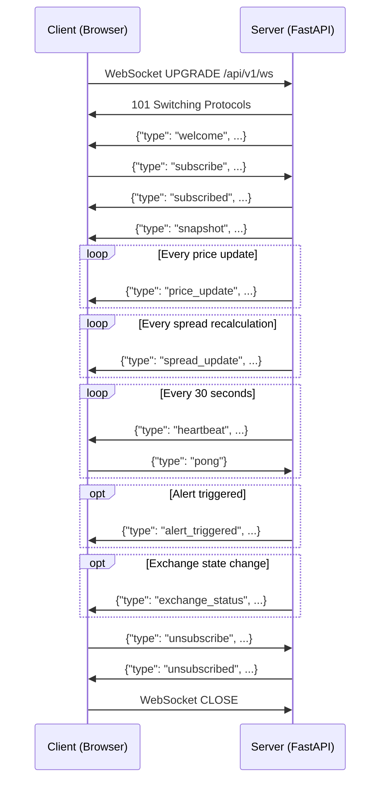
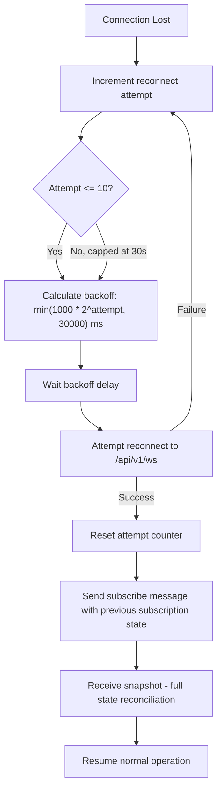
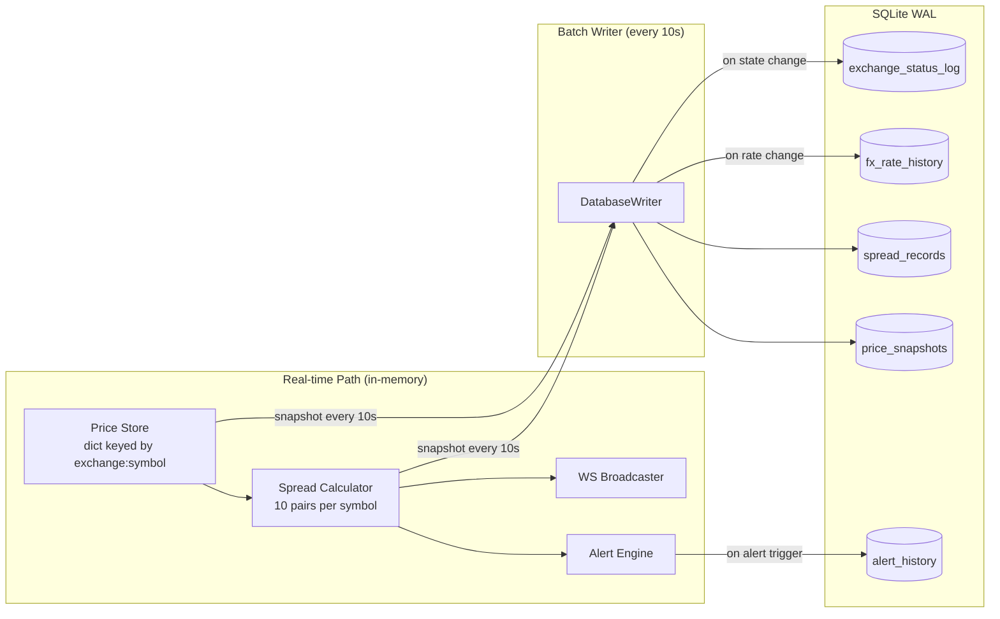

# API 설계 및 데이터 모델 — 암호화폐 차익거래 모니터

**문서 작성일:** 2026-02-28
**단계:** 5 (API 및 데이터 모델 설계)
**입력 의존성:** 1단계 (거래소 API 분석), 4단계 (시스템 아키텍처)
**목적:** 암호화폐 차익거래 모니터를 위한 구현 수준의 API 명세, WebSocket 이벤트 프로토콜, 데이터베이스 스키마, 공유 타입 정의

---

## 목차

1. [REST API 엔드포인트](#1-rest-api-엔드포인트)
2. [WebSocket 이벤트 프로토콜](#2-websocket-이벤트-프로토콜)
3. [데이터베이스 스키마](#3-데이터베이스-스키마)
4. [공유 타입 정의](#4-공유-타입-정의)
5. [데이터 유효성 검사 규칙](#5-데이터-유효성-검사-규칙)
6. [교차 단계 추적성](#6-교차-단계-추적성)

---

## 1. REST API 엔드포인트

모든 REST 엔드포인트는 `/api/v1/` 하위에 버전 관리된다. 응답은 UTF-8 인코딩의 JSON을 사용한다. 에러 응답은 일관된 봉투(envelope) 형식을 따른다. 이 포트폴리오 프로젝트는 단일 사용자 배포이므로 인증이 필요하지 않다.

[trace:step-4:design-decision-dd-1] DD-1에 따라, 모든 REST 및 WebSocket 엔드포인트는 단일 FastAPI/Uvicorn 프로세스에서 제공된다. 기본 아키텍처에는 API 게이트웨이나 리버스 프록시 계층이 없다.

### 1.1 공통 응답 봉투

**성공 응답:**

```json
{
  "status": "ok",
  "data": { ... },
  "timestamp_ms": 1709107200000
}
```

**에러 응답:**

```json
{
  "status": "error",
  "error": {
    "code": "VALIDATION_ERROR",
    "message": "threshold_pct must be between 0.1 and 50.0",
    "details": { "field": "threshold_pct", "value": -1.0 }
  },
  "timestamp_ms": 1709107200000
}
```

**에러 코드:**

| 코드 | HTTP 상태 | 설명 |
|------|------------|-------------|
| `VALIDATION_ERROR` | 422 | 요청 본문 또는 쿼리 파라미터 유효성 검사 실패 |
| `NOT_FOUND` | 404 | 요청한 리소스가 존재하지 않음 |
| `CONFLICT` | 409 | 리소스 중복 또는 유효하지 않은 상태 전환 |
| `RATE_LIMITED` | 429 | 요청 빈도 초과 |
| `INTERNAL_ERROR` | 500 | 예기치 않은 서버 에러 |
| `SERVICE_UNAVAILABLE` | 503 | 백엔드 의존성 사용 불가 (예: 모든 거래소 연결 끊김) |

### 1.2 페이지네이션 규칙

대량의 데이터셋을 반환할 수 있는 모든 목록 엔드포인트는 커서 기반 페이지네이션을 지원한다.

| 파라미터 | 타입 | 기본값 | 설명 |
|-----------|------|---------|-------------|
| `limit` | integer | 50 | 페이지당 항목 수 (최대: 200) |
| `offset` | integer | 0 | 건너뛸 항목 수 |

페이지네이션된 응답에는 `pagination` 필드가 포함된다.

```json
{
  "status": "ok",
  "data": [ ... ],
  "pagination": {
    "total": 1523,
    "limit": 50,
    "offset": 0,
    "has_more": true
  },
  "timestamp_ms": 1709107200000
}
```

### 1.3 요청 빈도 제한

모든 엔드포인트는 클라이언트 IP별 단일 요청 빈도 제한 풀을 공유한다.

| 등급 | 엔드포인트 | 제한 | 기간 |
|------|-----------|-------|--------|
| Standard | 모든 읽기 엔드포인트 (`GET`) | 60 요청 | 1분 |
| Write | 모든 쓰기 엔드포인트 (`POST`, `PUT`, `DELETE`) | 20 요청 | 1분 |
| Health | `GET /api/v1/health` | 120 요청 | 1분 |

요청 빈도 제한 헤더는 모든 응답에 포함된다.

```
X-RateLimit-Limit: 60
X-RateLimit-Remaining: 57
X-RateLimit-Reset: 1709107260
```

요청 빈도가 초과되면 서버는 HTTP 429로 응답한다.

```json
{
  "status": "error",
  "error": {
    "code": "RATE_LIMITED",
    "message": "Rate limit exceeded. Retry after 23 seconds.",
    "details": { "retry_after_seconds": 23 }
  }
}
```

---

### 1.4 상태 확인 및 시스템

#### `GET /api/v1/health`

거래소 연결 현황을 포함한 서버 상태 확인.

**요청:** 파라미터 없음.

**응답 (200):**

```json
{
  "status": "ok",
  "data": {
    "server": {
      "uptime_seconds": 86412,
      "version": "1.0.0",
      "python_version": "3.12.4",
      "started_at": "2026-02-27T02:00:00Z"
    },
    "exchanges": {
      "total": 5,
      "connected": 4,
      "disconnected": 1,
      "summary": {
        "bithumb": "ACTIVE",
        "upbit": "ACTIVE",
        "coinone": "WAIT_RETRY",
        "binance": "ACTIVE",
        "bybit": "ACTIVE"
      }
    },
    "database": {
      "status": "ok",
      "size_mb": 142.5,
      "wal_size_mb": 0.8
    },
    "fx_rate": {
      "rate": "1320.50",
      "source": "upbit",
      "is_stale": false,
      "last_update_ms": 1709107198000
    },
    "tracked_symbols": ["BTC", "ETH", "XRP", "SOL", "DOGE"],
    "active_alerts": 12,
    "dashboard_clients": 2
  },
  "timestamp_ms": 1709107200000
}
```

---

### 1.5 거래소 상태

#### `GET /api/v1/exchanges`

5개 거래소 전체의 현재 연결 상태와 상세 메타데이터.

**요청:** 파라미터 없음.

**응답 (200):**

```json
{
  "status": "ok",
  "data": [
    {
      "id": "bithumb",
      "name": "Bithumb",
      "currency": "KRW",
      "state": "ACTIVE",
      "ws_url": "wss://ws-api.bithumb.com/websocket/v1",
      "last_message_ms": 1709107199800,
      "latency_ms": 23,
      "reconnect_count": 0,
      "connected_since_ms": 1709020800000,
      "is_stale": false,
      "stale_threshold_ms": 5000,
      "supported_symbols": ["BTC", "ETH", "XRP", "SOL", "DOGE"]
    },
    {
      "id": "upbit",
      "name": "Upbit",
      "currency": "KRW",
      "state": "ACTIVE",
      "ws_url": "wss://api.upbit.com/websocket/v1",
      "last_message_ms": 1709107199900,
      "latency_ms": 15,
      "reconnect_count": 1,
      "connected_since_ms": 1709050000000,
      "is_stale": false,
      "stale_threshold_ms": 5000,
      "supported_symbols": ["BTC", "ETH", "XRP", "SOL", "DOGE"]
    },
    {
      "id": "coinone",
      "name": "Coinone",
      "currency": "KRW",
      "state": "WAIT_RETRY",
      "ws_url": "wss://stream.coinone.co.kr",
      "last_message_ms": 1709107190000,
      "latency_ms": null,
      "reconnect_count": 3,
      "connected_since_ms": null,
      "is_stale": true,
      "stale_threshold_ms": 5000,
      "fallback_mode": "REST_POLLING",
      "supported_symbols": ["BTC", "ETH", "XRP", "SOL", "DOGE"]
    },
    {
      "id": "binance",
      "name": "Binance",
      "currency": "USDT",
      "state": "ACTIVE",
      "ws_url": "wss://stream.binance.com:9443/ws",
      "last_message_ms": 1709107199950,
      "latency_ms": 45,
      "reconnect_count": 0,
      "connected_since_ms": 1709020800000,
      "is_stale": false,
      "stale_threshold_ms": 5000,
      "supported_symbols": ["BTC", "ETH", "XRP", "SOL", "DOGE"]
    },
    {
      "id": "bybit",
      "name": "Bybit",
      "currency": "USDT",
      "state": "ACTIVE",
      "ws_url": "wss://stream.bybit.com/v5/public/spot",
      "last_message_ms": 1709107199700,
      "latency_ms": 52,
      "reconnect_count": 0,
      "connected_since_ms": 1709020800000,
      "is_stale": false,
      "stale_threshold_ms": 5000,
      "supported_symbols": ["BTC", "ETH", "XRP", "SOL", "DOGE"]
    }
  ],
  "timestamp_ms": 1709107200000
}
```

**거래소 상태 열거형 값:**

| 상태 | 설명 |
|-------|-------------|
| `DISCONNECTED` | 활성 연결 없음 |
| `CONNECTING` | TCP/TLS/WS 핸드셰이크 진행 중 |
| `CONNECTED` | 핸드셰이크 완료, 아직 구독하지 않은 상태 |
| `SUBSCRIBING` | 구독 메시지 발송 후 확인 대기 중 |
| `ACTIVE` | 실시간 데이터 수신 중 |
| `WAIT_RETRY` | 다음 재연결 시도까지 백오프 대기 중 |

---

### 1.6 가격 스냅샷

#### `GET /api/v1/prices`

전체 거래소에서 추적 중인 모든 심볼의 최신 가격.

**쿼리 파라미터:**

| 파라미터 | 타입 | 필수 | 설명 |
|-----------|------|----------|-------------|
| `symbols` | string | 아니오 | 쉼표로 구분된 심볼 필터 (예: `BTC,ETH`). 기본값은 전체 추적 심볼. |
| `exchanges` | string | 아니오 | 쉼표로 구분된 거래소 필터 (예: `bithumb,upbit`). 기본값은 전체. |

**응답 (200):**

```json
{
  "status": "ok",
  "data": {
    "prices": [
      {
        "exchange": "bithumb",
        "symbol": "BTC",
        "price": "88200000",
        "currency": "KRW",
        "bid_price": null,
        "ask_price": null,
        "volume_24h": "1234.5678",
        "timestamp_ms": 1709107199800,
        "received_at_ms": 1709107199823,
        "is_stale": false
      },
      {
        "exchange": "binance",
        "symbol": "BTC",
        "price": "65000.15",
        "currency": "USDT",
        "bid_price": "64999.90",
        "ask_price": "65000.20",
        "volume_24h": "45678.1234",
        "timestamp_ms": 1709107199950,
        "received_at_ms": 1709107199995,
        "is_stale": false
      }
    ],
    "fx_rate": {
      "rate": "1320.50",
      "source": "upbit",
      "is_stale": false,
      "last_update_ms": 1709107198000
    }
  },
  "timestamp_ms": 1709107200000
}
```

#### `GET /api/v1/prices/{symbol}`

특정 심볼의 전체 거래소 최신 가격.

**경로 파라미터:**

| 파라미터 | 타입 | 필수 | 설명 |
|-----------|------|----------|-------------|
| `symbol` | string | 예 | 정규 심볼 (예: `BTC`, `ETH`) |

**쿼리 파라미터:**

| 파라미터 | 타입 | 필수 | 설명 |
|-----------|------|----------|-------------|
| `exchanges` | string | 아니오 | 쉼표로 구분된 거래소 필터 |

**응답 (200):** `GET /api/v1/prices`와 동일한 구조이나 단일 심볼로 필터링됨.

**에러 (404):** 추적 대상이 아닌 심볼.

#### `GET /api/v1/prices/history`

시간 범위 필터링 및 페이지네이션을 지원하는 과거 가격 스냅샷.

**쿼리 파라미터:**

| 파라미터 | 타입 | 필수 | 기본값 | 설명 |
|-----------|------|----------|---------|-------------|
| `symbol` | string | 예 | - | 조회할 심볼 (예: `BTC`) |
| `exchange` | string | 아니오 | all | 쉼표로 구분된 거래소 필터 |
| `start_time` | integer | 아니오 | 24시간 전 | 시작 타임스탬프 (Unix ms) |
| `end_time` | integer | 아니오 | 현재 | 종료 타임스탬프 (Unix ms) |
| `interval` | string | 아니오 | `10s` | 집계 간격: `10s`, `1m`, `5m`, `1h` |
| `limit` | integer | 아니오 | 50 | 최대 레코드 수 (최대: 1000) |
| `offset` | integer | 아니오 | 0 | 페이지네이션 오프셋 |

**응답 (200):**

```json
{
  "status": "ok",
  "data": [
    {
      "exchange": "bithumb",
      "symbol": "BTC",
      "price": "88200000",
      "currency": "KRW",
      "volume_24h": "1234.5678",
      "timestamp_ms": 1709107190000,
      "created_at": "2026-02-28T05:00:00Z"
    }
  ],
  "pagination": {
    "total": 8640,
    "limit": 50,
    "offset": 0,
    "has_more": true
  },
  "timestamp_ms": 1709107200000
}
```

**집계 간격:** `interval`이 원시 10초 스냅샷 빈도를 초과하면, 서버는 잘린 타임스탬프에 대한 SQLite `GROUP BY`를 사용하여 쿼리 내 집계를 수행한다. 반환되는 `price`는 각 간격 버킷 내의 **마지막** (종가) 가격이다. `volume_24h`는 간격 마감 시점의 값이다.

---

### 1.7 스프레드 데이터

#### `GET /api/v1/spreads`

추적 중인 모든 심볼과 거래소 쌍에 대한 현재 스프레드 매트릭스.

**쿼리 파라미터:**

| 파라미터 | 타입 | 필수 | 설명 |
|-----------|------|----------|-------------|
| `symbols` | string | 아니오 | 쉼표로 구분된 심볼 필터. 기본값은 전체 추적 심볼. |
| `spread_type` | string | 아니오 | `kimchi_premium`, `same_currency`, 또는 생략 시 둘 다 |
| `include_stale` | boolean | 아니오 | 만료된 스프레드 포함 여부 (기본값: `true`) |

**응답 (200):**

```json
{
  "status": "ok",
  "data": {
    "spreads": [
      {
        "exchange_a": "bithumb",
        "exchange_b": "binance",
        "symbol": "BTC",
        "spread_pct": "3.42",
        "spread_type": "kimchi_premium",
        "is_stale": false,
        "stale_reason": null,
        "price_a": "88200000",
        "price_a_currency": "KRW",
        "price_b": "65000.15",
        "price_b_currency": "USDT",
        "fx_rate": "1320.50",
        "fx_source": "upbit",
        "timestamp_ms": 1709107199800
      },
      {
        "exchange_a": "bithumb",
        "exchange_b": "upbit",
        "symbol": "BTC",
        "spread_pct": "0.23",
        "spread_type": "same_currency",
        "is_stale": false,
        "stale_reason": null,
        "price_a": "88200000",
        "price_a_currency": "KRW",
        "price_b": "88000000",
        "price_b_currency": "KRW",
        "fx_rate": null,
        "fx_source": null,
        "timestamp_ms": 1709107199800
      }
    ],
    "matrix_summary": {
      "symbol": "BTC",
      "max_spread": {
        "pair": "bithumb-binance",
        "spread_pct": "3.42",
        "type": "kimchi_premium"
      },
      "min_spread": {
        "pair": "binance-bybit",
        "spread_pct": "-0.05",
        "type": "same_currency"
      },
      "stale_pairs": 2,
      "total_pairs": 10
    }
  },
  "timestamp_ms": 1709107200000
}
```

#### `GET /api/v1/spreads/history`

시간 범위 필터링 및 페이지네이션을 지원하는 과거 스프레드 데이터.

**쿼리 파라미터:**

| 파라미터 | 타입 | 필수 | 기본값 | 설명 |
|-----------|------|----------|---------|-------------|
| `symbol` | string | 예 | - | 조회할 심볼 |
| `exchange_a` | string | 아니오 | any | 쌍의 첫 번째 거래소 |
| `exchange_b` | string | 아니오 | any | 쌍의 두 번째 거래소 |
| `spread_type` | string | 아니오 | both | `kimchi_premium` 또는 `same_currency` |
| `start_time` | integer | 아니오 | 24시간 전 | 시작 타임스탬프 (Unix ms) |
| `end_time` | integer | 아니오 | 현재 | 종료 타임스탬프 (Unix ms) |
| `interval` | string | 아니오 | `10s` | 집계 간격: `10s`, `1m`, `5m`, `1h` |
| `limit` | integer | 아니오 | 50 | 최대 레코드 수 (최대: 1000) |
| `offset` | integer | 아니오 | 0 | 페이지네이션 오프셋 |

**응답 (200):**

```json
{
  "status": "ok",
  "data": [
    {
      "exchange_a": "bithumb",
      "exchange_b": "binance",
      "symbol": "BTC",
      "spread_pct": "3.42",
      "spread_type": "kimchi_premium",
      "is_stale": false,
      "fx_rate": "1320.50",
      "fx_source": "upbit",
      "timestamp_ms": 1709107190000,
      "created_at": "2026-02-28T05:00:00Z"
    }
  ],
  "pagination": {
    "total": 8640,
    "limit": 50,
    "offset": 0,
    "has_more": true
  },
  "timestamp_ms": 1709107200000
}
```

---

### 1.8 알림 설정 CRUD

#### `GET /api/v1/alerts`

모든 알림 설정 목록 조회.

**쿼리 파라미터:**

| 파라미터 | 타입 | 필수 | 기본값 | 설명 |
|-----------|------|----------|---------|-------------|
| `enabled` | boolean | 아니오 | all | 활성/비활성 상태로 필터링 |
| `symbol` | string | 아니오 | all | 심볼로 필터링 |
| `limit` | integer | 아니오 | 50 | 최대 레코드 수 |
| `offset` | integer | 아니오 | 0 | 페이지네이션 오프셋 |

**응답 (200):**

```json
{
  "status": "ok",
  "data": [
    {
      "id": 1,
      "chat_id": 123456789,
      "symbol": "BTC",
      "exchange_a": null,
      "exchange_b": null,
      "threshold_pct": "3.00",
      "direction": "above",
      "cooldown_minutes": 5,
      "enabled": true,
      "created_at": "2026-02-27T10:00:00Z",
      "updated_at": "2026-02-27T10:00:00Z",
      "last_triggered_at": "2026-02-28T04:30:00Z",
      "trigger_count": 7
    }
  ],
  "pagination": {
    "total": 12,
    "limit": 50,
    "offset": 0,
    "has_more": false
  },
  "timestamp_ms": 1709107200000
}
```

#### `POST /api/v1/alerts`

새 알림 설정 생성.

**요청 본문:**

```json
{
  "chat_id": 123456789,
  "symbol": "BTC",
  "exchange_a": "bithumb",
  "exchange_b": "binance",
  "threshold_pct": 3.0,
  "direction": "above",
  "cooldown_minutes": 5,
  "enabled": true
}
```

**필드 제약 조건:**

| 필드 | 타입 | 필수 | 제약 조건 |
|-------|------|----------|-------------|
| `chat_id` | integer | 예 | 양의 정수 (Telegram 채팅 ID) |
| `symbol` | string | 아니오 | 추적 심볼 목록에 존재해야 함; `null` = 전체 심볼 |
| `exchange_a` | string | 아니오 | 유효한 거래소 ID여야 함; `null` = 아무 거래소 |
| `exchange_b` | string | 아니오 | 유효한 거래소 ID여야 함; `null` = 아무 거래소 |
| `threshold_pct` | number | 예 | 0.1에서 50.0 (포함) |
| `direction` | string | 예 | `above`, `below`, `both` 중 하나 |
| `cooldown_minutes` | integer | 아니오 | 1에서 60 (기본값: 5) |
| `enabled` | boolean | 아니오 | 기본값: `true` |

**응답 (201):**

```json
{
  "status": "ok",
  "data": {
    "id": 13,
    "chat_id": 123456789,
    "symbol": "BTC",
    "exchange_a": "bithumb",
    "exchange_b": "binance",
    "threshold_pct": "3.00",
    "direction": "above",
    "cooldown_minutes": 5,
    "enabled": true,
    "created_at": "2026-02-28T05:00:00Z",
    "updated_at": "2026-02-28T05:00:00Z",
    "last_triggered_at": null,
    "trigger_count": 0
  },
  "timestamp_ms": 1709107200000
}
```

**에러 (422):** 유효성 검사 실패 (예: 임계값 범위 초과).

#### `GET /api/v1/alerts/{id}`

ID로 단일 알림 설정 조회.

**응답 (200):** 목록 엔드포인트의 단일 항목과 동일한 구조.

**에러 (404):** 알림을 찾을 수 없음.

#### `PUT /api/v1/alerts/{id}`

기존 알림 설정 수정. 모든 필드는 선택 사항이며, 제공된 필드만 갱신된다.

**요청 본문:**

```json
{
  "threshold_pct": 2.5,
  "enabled": false
}
```

**응답 (200):** 갱신된 알림 객체.

**에러 (404):** 알림을 찾을 수 없음.
**에러 (422):** 유효성 검사 실패.

#### `DELETE /api/v1/alerts/{id}`

알림 설정 삭제.

**응답 (200):**

```json
{
  "status": "ok",
  "data": {
    "deleted_id": 13,
    "message": "Alert configuration deleted"
  },
  "timestamp_ms": 1709107200000
}
```

**에러 (404):** 알림을 찾을 수 없음.

#### `GET /api/v1/alerts/history`

알림 발동 이력 로그.

**쿼리 파라미터:**

| 파라미터 | 타입 | 필수 | 기본값 | 설명 |
|-----------|------|----------|---------|-------------|
| `alert_config_id` | integer | 아니오 | all | 특정 알림 설정으로 필터링 |
| `symbol` | string | 아니오 | all | 심볼로 필터링 |
| `delivered` | boolean | 아니오 | all | Telegram 전송 상태로 필터링 |
| `start_time` | integer | 아니오 | 24시간 전 | 시작 타임스탬프 (Unix ms) |
| `end_time` | integer | 아니오 | 현재 | 종료 타임스탬프 (Unix ms) |
| `limit` | integer | 아니오 | 50 | 최대 레코드 수 |
| `offset` | integer | 아니오 | 0 | 페이지네이션 오프셋 |

**응답 (200):**

```json
{
  "status": "ok",
  "data": [
    {
      "id": 501,
      "alert_config_id": 1,
      "exchange_a": "bithumb",
      "exchange_b": "binance",
      "symbol": "BTC",
      "spread_pct": "3.42",
      "spread_type": "kimchi_premium",
      "threshold_pct": "3.00",
      "direction": "above",
      "message_text": "...",
      "telegram_delivered": true,
      "telegram_message_id": 98765,
      "fx_rate": "1320.50",
      "fx_source": "upbit",
      "created_at": "2026-02-28T04:30:00Z"
    }
  ],
  "pagination": {
    "total": 47,
    "limit": 50,
    "offset": 0,
    "has_more": false
  },
  "timestamp_ms": 1709107200000
}
```

---

### 1.9 추적 심볼

#### `GET /api/v1/symbols`

모든 추적 심볼과 그 상태 조회.

**응답 (200):**

```json
{
  "status": "ok",
  "data": [
    {
      "symbol": "BTC",
      "enabled": true,
      "exchange_coverage": {
        "bithumb": true,
        "upbit": true,
        "coinone": true,
        "binance": true,
        "bybit": true
      },
      "created_at": "2026-02-27T02:00:00Z"
    },
    {
      "symbol": "ETH",
      "enabled": true,
      "exchange_coverage": {
        "bithumb": true,
        "upbit": true,
        "coinone": true,
        "binance": true,
        "bybit": true
      },
      "created_at": "2026-02-27T02:00:00Z"
    }
  ],
  "timestamp_ms": 1709107200000
}
```

#### `PUT /api/v1/symbols`

추적 심볼 목록 갱신. 전체 목록을 교체한다.

**요청 본문:**

```json
{
  "symbols": ["BTC", "ETH", "XRP", "SOL", "DOGE", "ADA"]
}
```

**제약 조건:**
- 1개에서 20개의 심볼 허용
- 각 심볼은 대문자, 2~10자, 영숫자만 가능
- 중복 심볼은 거부됨

**응답 (200):**

```json
{
  "status": "ok",
  "data": {
    "symbols": ["BTC", "ETH", "XRP", "SOL", "DOGE", "ADA"],
    "added": ["ADA"],
    "removed": [],
    "message": "Tracked symbols updated. Exchange subscriptions will refresh within 5 seconds."
  },
  "timestamp_ms": 1709107200000
}
```

---

### 1.10 환율

#### `GET /api/v1/fx-rate`

현재 KRW/USD 환율 및 소스 정보.

[trace:step-4:design-decision-dd-4] DD-4에 따라, 주요 환율 소스는 Upbit의 KRW-USDT WebSocket 티커이다. ExchangeRate-API REST 엔드포인트는 폴백으로 사용된다. USDT는 한국 트레이더가 실제로 경험하는 환전 비율을 반영하므로 USD 프록시로 사용된다.

**응답 (200):**

```json
{
  "status": "ok",
  "data": {
    "rate": "1320.50",
    "source": "upbit",
    "is_stale": false,
    "last_update_ms": 1709107198000,
    "staleness_threshold_ms": 60000,
    "age_ms": 2000,
    "fallback_available": true,
    "fallback_rate": "1319.80",
    "fallback_source": "exchangerate-api",
    "fallback_last_update_ms": 1709103600000
  },
  "timestamp_ms": 1709107200000
}
```

---

### 1.11 사용자 환경설정

#### `GET /api/v1/preferences`

현재 대시보드 사용자 환경설정 조회. 단일 사용자 시스템이므로 사용자 식별자가 필요하지 않다.

**응답 (200):**

```json
{
  "status": "ok",
  "data": {
    "dashboard": {
      "default_symbol": "BTC",
      "visible_exchanges": ["bithumb", "upbit", "coinone", "binance", "bybit"],
      "spread_matrix_mode": "percentage",
      "chart_interval": "5m",
      "theme": "dark"
    },
    "notifications": {
      "telegram_enabled": true,
      "telegram_chat_id": 123456789,
      "sound_enabled": true
    },
    "timezone": "Asia/Seoul",
    "locale": "ko-KR"
  },
  "timestamp_ms": 1709107200000
}
```

#### `PUT /api/v1/preferences`

사용자 환경설정 갱신. 부분 갱신 지원.

**요청 본문:**

```json
{
  "dashboard": {
    "default_symbol": "ETH",
    "theme": "light"
  },
  "timezone": "UTC"
}
```

**필드 제약 조건:**

| 필드 | 타입 | 제약 조건 |
|-------|------|-------------|
| `dashboard.default_symbol` | string | 추적 중인 심볼이어야 함 |
| `dashboard.visible_exchanges` | string[] | 1~5개의 유효한 거래소 ID |
| `dashboard.spread_matrix_mode` | string | `percentage` 또는 `absolute` |
| `dashboard.chart_interval` | string | `10s`, `1m`, `5m`, `1h` |
| `dashboard.theme` | string | `dark` 또는 `light` |
| `notifications.telegram_enabled` | boolean | - |
| `notifications.telegram_chat_id` | integer | 양의 정수 |
| `notifications.sound_enabled` | boolean | - |
| `timezone` | string | 유효한 IANA 시간대 식별자 |
| `locale` | string | `ko-KR` 또는 `en-US` |

**응답 (200):** 갱신된 환경설정 객체.

---

### 1.12 엔드포인트 요약 테이블

| 메서드 | 경로 | 설명 | 요청 빈도 등급 |
|--------|------|-------------|-----------|
| `GET` | `/api/v1/health` | 서버 상태 + 거래소 요약 | Health |
| `GET` | `/api/v1/exchanges` | 상세 거래소 연결 상태 | Standard |
| `GET` | `/api/v1/prices` | 최신 가격 (전체 거래소, 전체 심볼) | Standard |
| `GET` | `/api/v1/prices/{symbol}` | 특정 심볼의 최신 가격 | Standard |
| `GET` | `/api/v1/prices/history` | 과거 가격 스냅샷 | Standard |
| `GET` | `/api/v1/spreads` | 현재 스프레드 매트릭스 | Standard |
| `GET` | `/api/v1/spreads/history` | 과거 스프레드 데이터 | Standard |
| `GET` | `/api/v1/alerts` | 알림 설정 목록 | Standard |
| `POST` | `/api/v1/alerts` | 알림 설정 생성 | Write |
| `GET` | `/api/v1/alerts/{id}` | 단일 알림 설정 조회 | Standard |
| `PUT` | `/api/v1/alerts/{id}` | 알림 설정 수정 | Write |
| `DELETE` | `/api/v1/alerts/{id}` | 알림 설정 삭제 | Write |
| `GET` | `/api/v1/alerts/history` | 알림 발동 이력 | Standard |
| `GET` | `/api/v1/symbols` | 추적 심볼 목록 | Standard |
| `PUT` | `/api/v1/symbols` | 추적 심볼 목록 갱신 | Write |
| `GET` | `/api/v1/fx-rate` | 현재 KRW/USD 환율 | Standard |
| `GET` | `/api/v1/preferences` | 사용자 환경설정 조회 | Standard |
| `PUT` | `/api/v1/preferences` | 사용자 환경설정 갱신 | Write |

---

## 2. WebSocket 이벤트 프로토콜

서버는 실시간 대시보드 업데이트를 위한 단일 WebSocket 엔드포인트를 제공한다.

```
WS /api/v1/ws
```

모든 메시지는 JSON 인코딩된 텍스트 프레임이다. 바이너리 프레임은 사용하지 않는다.

### 2.1 연결 생명주기



### 2.2 서버-클라이언트 메시지 타입

모든 서버 메시지에는 `type` 필드, `data` 페이로드, 순서 확인 및 누락 이벤트 감지를 위한 `seq` 시퀀스 번호가 포함된다.

```json
{
  "type": "<event_type>",
  "data": { ... },
  "seq": 12345,
  "timestamp_ms": 1709107200000
}
```

`seq` 필드는 연결별 단조 증가 정수이다. 클라이언트는 시퀀스 간격을 확인하여 누락된 이벤트를 감지할 수 있다.

---

#### 2.2.1 `welcome`

WebSocket 연결이 수립된 직후 전송된다.

```json
{
  "type": "welcome",
  "data": {
    "server_version": "1.0.0",
    "available_symbols": ["BTC", "ETH", "XRP", "SOL", "DOGE"],
    "exchanges": ["bithumb", "upbit", "coinone", "binance", "bybit"],
    "heartbeat_interval_ms": 30000
  },
  "seq": 0,
  "timestamp_ms": 1709107200000
}
```

#### 2.2.2 `snapshot`

구독 성공 후 전송된다. 구독된 모든 심볼의 전체 현재 상태를 포함하므로, 클라이언트는 첫 번째 증분 업데이트를 기다리지 않고 즉시 렌더링할 수 있다.

```json
{
  "type": "snapshot",
  "data": {
    "prices": [
      {
        "exchange": "bithumb",
        "symbol": "BTC",
        "price": "88200000",
        "currency": "KRW",
        "bid_price": null,
        "ask_price": null,
        "volume_24h": "1234.5678",
        "timestamp_ms": 1709107199800,
        "is_stale": false
      }
    ],
    "spreads": [
      {
        "exchange_a": "bithumb",
        "exchange_b": "binance",
        "symbol": "BTC",
        "spread_pct": "3.42",
        "spread_type": "kimchi_premium",
        "is_stale": false,
        "fx_rate": "1320.50",
        "fx_source": "upbit",
        "timestamp_ms": 1709107199800
      }
    ],
    "exchange_statuses": [
      {
        "exchange": "bithumb",
        "state": "ACTIVE",
        "latency_ms": 23,
        "last_message_ms": 1709107199800
      }
    ],
    "fx_rate": {
      "rate": "1320.50",
      "source": "upbit",
      "is_stale": false
    }
  },
  "seq": 2,
  "timestamp_ms": 1709107200000
}
```

#### 2.2.3 `price_update`

구독된 심볼에 대해 어느 거래소에서든 정규화된 가격 틱이 발생할 때마다 전송된다.

```json
{
  "type": "price_update",
  "data": {
    "exchange": "bithumb",
    "symbol": "BTC",
    "price": "88250000",
    "currency": "KRW",
    "bid_price": null,
    "ask_price": null,
    "volume_24h": "1235.0012",
    "timestamp_ms": 1709107200500,
    "is_stale": false
  },
  "seq": 15,
  "timestamp_ms": 1709107200510
}
```

#### 2.2.4 `spread_update`

가격 업데이트로 인해 스프레드 재계산이 수행된 후 전송된다. 영향을 받는 거래소 쌍별로 하나씩, 여러 스프레드 업데이트가 연속으로 빠르게 도착할 수 있다.

```json
{
  "type": "spread_update",
  "data": {
    "exchange_a": "bithumb",
    "exchange_b": "binance",
    "symbol": "BTC",
    "spread_pct": "3.45",
    "spread_type": "kimchi_premium",
    "is_stale": false,
    "stale_reason": null,
    "price_a": "88250000",
    "price_a_currency": "KRW",
    "price_b": "65010.20",
    "price_b_currency": "USDT",
    "fx_rate": "1320.50",
    "fx_source": "upbit",
    "timestamp_ms": 1709107200500
  },
  "seq": 16,
  "timestamp_ms": 1709107200512
}
```

#### 2.2.5 `alert_triggered`

알림 임계값이 초과되었을 때 전송된다. 이것은 대시보드 알림이며, Telegram 메시지는 알림 엔진에 의해 별도로 전송된다.

[trace:step-4:design-decision-dd-5] 3단계 알림 심각도 매핑 (Info >= 1.0%, Warning >= 2.0%, Critical >= 3.0%)은 서버에서 적용된다. `severity` 필드를 통해 프론트엔드는 등급별로 다른 시각적 처리(색상, 애니메이션)를 적용할 수 있다.

```json
{
  "type": "alert_triggered",
  "data": {
    "alert_config_id": 1,
    "exchange_a": "bithumb",
    "exchange_b": "binance",
    "symbol": "BTC",
    "spread_pct": "3.42",
    "spread_type": "kimchi_premium",
    "threshold_pct": "3.00",
    "direction": "above",
    "severity": "critical",
    "fx_rate": "1320.50",
    "fx_source": "upbit",
    "telegram_delivered": true,
    "timestamp_ms": 1709107200500
  },
  "seq": 17,
  "timestamp_ms": 1709107200600
}
```

**심각도 매핑:**

| 스프레드 (절대값) | 심각도 | 프론트엔드 처리 |
|-------------------|----------|-------------------|
| >= 3.0% | `critical` | 빨간색 배지, 맥동 애니메이션, 사운드 알림 |
| >= 2.0% | `warning` | 주황색 배지, 약한 애니메이션 |
| >= 1.0% | `info` | 노란색 배지, 애니메이션 없음 |
| < 1.0% | (알림 없음) | - |

#### 2.2.6 `exchange_status`

거래소 커넥터의 상태가 변경될 때 전송된다 (예: 연결 해제, 재연결, 데이터 만료 감지).

```json
{
  "type": "exchange_status",
  "data": {
    "exchange": "coinone",
    "state": "WAIT_RETRY",
    "previous_state": "ACTIVE",
    "latency_ms": null,
    "last_message_ms": 1709107190000,
    "reconnect_attempt": 3,
    "is_stale": true,
    "fallback_mode": "REST_POLLING",
    "reason": "WebSocket connection reset by peer"
  },
  "seq": 18,
  "timestamp_ms": 1709107200700
}
```

#### 2.2.7 `heartbeat`

서버가 30초마다 전송한다. 클라이언트는 10초 이내에 `pong`으로 응답해야 하며, 그렇지 않으면 서버가 연결을 종료할 수 있다.

```json
{
  "type": "heartbeat",
  "data": {
    "server_time_ms": 1709107230000
  },
  "seq": 19,
  "timestamp_ms": 1709107230000
}
```

#### 2.2.8 `error`

서버가 클라이언트 메시지를 처리하는 중 에러가 발생했을 때 전송된다.

```json
{
  "type": "error",
  "data": {
    "code": "INVALID_SYMBOL",
    "message": "Symbol 'INVALID' is not tracked",
    "original_message_type": "subscribe"
  },
  "seq": 20,
  "timestamp_ms": 1709107230100
}
```

### 2.3 클라이언트-서버 메시지 타입

#### 2.3.1 `subscribe`

특정 심볼에 대한 실시간 업데이트를 구독한다. 데이터 수신을 시작하려면 연결 후 반드시 전송해야 한다.

```json
{
  "type": "subscribe",
  "symbols": ["BTC", "ETH"],
  "channels": ["prices", "spreads", "alerts", "exchange_status"]
}
```

**필드:**

| 필드 | 타입 | 필수 | 기본값 | 설명 |
|-------|------|----------|---------|-------------|
| `symbols` | string[] | 아니오 | 전체 추적 심볼 | 구독할 심볼 |
| `channels` | string[] | 아니오 | 전체 | 채널 필터 |

**이용 가능한 채널:**

| 채널 | 전달되는 이벤트 |
|---------|-----------------|
| `prices` | `price_update` |
| `spreads` | `spread_update` |
| `alerts` | `alert_triggered` |
| `exchange_status` | `exchange_status` |

**서버 응답:** `subscribed` 확인 후 `snapshot` 전송.

```json
{
  "type": "subscribed",
  "data": {
    "symbols": ["BTC", "ETH"],
    "channels": ["prices", "spreads", "alerts", "exchange_status"]
  },
  "seq": 1,
  "timestamp_ms": 1709107200000
}
```

#### 2.3.2 `unsubscribe`

구독에서 특정 심볼 또는 채널을 제거한다.

```json
{
  "type": "unsubscribe",
  "symbols": ["ETH"]
}
```

**서버 응답:**

```json
{
  "type": "unsubscribed",
  "data": {
    "symbols": ["ETH"],
    "remaining_symbols": ["BTC"]
  },
  "seq": 25,
  "timestamp_ms": 1709107300000
}
```

#### 2.3.3 `pong`

서버 하트비트에 대한 응답.

```json
{
  "type": "pong"
}
```

### 2.4 재연결 프로토콜

WebSocket 연결이 끊어지면, 클라이언트는 다음 재연결 전략을 따른다.



**핵심 동작:**

1. **자동 재구독:** 클라이언트는 현재 구독 상태(심볼 + 채널)를 저장하고, 재연결 후 `subscribe` 메시지를 다시 전송한다.
2. **스냅샷을 통한 상태 재조정:** 서버는 각 `subscribe` 이후 새로운 `snapshot`을 전송하여, 연결 해제 기간 동안 어떤 일이 발생했든 클라이언트가 올바른 현재 상태를 가지도록 보장한다.
3. **누락 이벤트 감지:** 클라이언트는 재연결 후 첫 번째 메시지의 `seq`를 마지막으로 수신한 `seq`와 비교한다. 간격이 있으면 누락된 이벤트가 있음을 의미하지만, `snapshot`이 이미 전체 현재 상태를 제공하므로 별도의 리플레이 메커니즘은 필요하지 않다.
4. **백오프:** 1초에서 최대 30초까지 지수 백오프를 적용하며, 지터는 없다 (단일 클라이언트이므로 썬더링 허드 우려 없음).

### 2.5 연결 제한

| 파라미터 | 값 | 근거 |
|-----------|-------|-----------|
| 최대 동시 WS 클라이언트 | 20 | 포트폴리오 프로젝트; 리소스 고갈 방지 |
| 클라이언트당 최대 구독 | 전체 심볼 (최대 20) | 클라이언트별 제한 불필요 |
| 하트비트 간격 | 30초 | 조기 연결 해제 감지와 대역폭 간의 균형 |
| Pong 타임아웃 | 10초 | 백그라운드 브라우저 탭을 위한 넉넉한 타임아웃 |
| 최대 메시지 크기 (클라이언트->서버) | 4 KB | Subscribe/unsubscribe 메시지는 작음 |
| 최대 메시지 크기 (서버->클라이언트) | 64 KB | Snapshot 메시지는 클 수 있음 |

---

## 3. 데이터베이스 스키마

[trace:step-4:design-decision-dd-6] DD-6에 따라, 데이터베이스는 10초 주기 스냅샷과 30일 보존 정책을 적용한 WAL 모드의 SQLite를 사용한다. 가격은 정확한 정밀도를 보존하기 위해 TEXT(Decimal의 문자열 표현)로 저장된다. SQLAlchemy 비동기 ORM을 사용하면 연결 문자열만 변경하여 향후 PostgreSQL/TimescaleDB로 마이그레이션할 수 있다.

[trace:step-4:design-decision-dd-8] DD-8에 따라, 인프라 오버헤드 제로를 위해 SQLite WAL 모드가 선택되었다. busy_timeout은 5000ms로, synchronous는 안전하면서도 빠른 쓰기를 위해 NORMAL로 설정된다.

### 3.1 엔터티-관계 다이어그램

```mermaid
erDiagram
    exchanges {
        TEXT id PK "e.g. bithumb"
        TEXT name "Display name e.g. Bithumb"
        TEXT currency "KRW or USDT"
        TEXT ws_url "WebSocket endpoint URL"
        TEXT rest_url "REST API base URL"
        INTEGER is_active "1=active, 0=disabled"
        INTEGER created_at "Unix timestamp seconds"
    }

    tracked_symbols {
        TEXT symbol PK "e.g. BTC"
        INTEGER enabled "1=tracking, 0=paused"
        INTEGER created_at "Unix timestamp seconds"
        INTEGER updated_at "Unix timestamp seconds"
    }

    price_snapshots {
        INTEGER id PK "AUTOINCREMENT"
        TEXT exchange_id FK "references exchanges.id"
        TEXT symbol FK "references tracked_symbols.symbol"
        TEXT price "Decimal string"
        TEXT currency "KRW or USDT"
        TEXT bid_price "Decimal string or NULL"
        TEXT ask_price "Decimal string or NULL"
        TEXT volume_24h "Decimal string"
        INTEGER exchange_timestamp_ms "Exchange server time"
        INTEGER received_at_ms "Local receipt time"
        INTEGER created_at "Unix timestamp seconds"
    }

    spread_records {
        INTEGER id PK "AUTOINCREMENT"
        TEXT exchange_a FK "references exchanges.id"
        TEXT exchange_b FK "references exchanges.id"
        TEXT symbol FK "references tracked_symbols.symbol"
        TEXT spread_pct "Decimal string"
        TEXT spread_type "kimchi_premium or same_currency"
        TEXT price_a "Decimal string"
        TEXT price_b "Decimal string"
        INTEGER is_stale "1=stale, 0=fresh"
        TEXT stale_reason "NULL if fresh"
        TEXT fx_rate "Decimal string or NULL"
        TEXT fx_source "upbit or exchangerate-api or NULL"
        INTEGER timestamp_ms "Calculation time"
        INTEGER created_at "Unix timestamp seconds"
    }

    alert_configs {
        INTEGER id PK "AUTOINCREMENT"
        INTEGER chat_id "Telegram chat ID"
        TEXT symbol "NULL means all symbols"
        TEXT exchange_a "NULL means any exchange"
        TEXT exchange_b "NULL means any exchange"
        TEXT threshold_pct "Decimal string"
        TEXT direction "above or below or both"
        INTEGER cooldown_minutes "1-60"
        INTEGER enabled "1 or 0"
        INTEGER created_at "Unix timestamp seconds"
        INTEGER updated_at "Unix timestamp seconds"
    }

    alert_history {
        INTEGER id PK "AUTOINCREMENT"
        INTEGER alert_config_id FK "references alert_configs.id"
        TEXT exchange_a "Snapshot at trigger time"
        TEXT exchange_b "Snapshot at trigger time"
        TEXT symbol "Snapshot at trigger time"
        TEXT spread_pct "Decimal string at trigger"
        TEXT spread_type "kimchi_premium or same_currency"
        TEXT threshold_pct "Threshold at trigger time"
        TEXT direction "Direction at trigger time"
        TEXT price_a "Decimal string"
        TEXT price_b "Decimal string"
        TEXT fx_rate "Decimal string or NULL"
        TEXT fx_source "Source or NULL"
        TEXT message_text "Full Telegram message"
        INTEGER telegram_delivered "1=sent, 0=failed"
        INTEGER telegram_message_id "Telegram msg ID or NULL"
        INTEGER created_at "Unix timestamp seconds"
    }

    exchange_status_log {
        INTEGER id PK "AUTOINCREMENT"
        TEXT exchange_id FK "references exchanges.id"
        TEXT state "Connection state enum value"
        TEXT previous_state "Previous state"
        INTEGER latency_ms "NULL if disconnected"
        TEXT reason "Disconnect reason or NULL"
        INTEGER created_at "Unix timestamp seconds"
    }

    fx_rate_history {
        INTEGER id PK "AUTOINCREMENT"
        TEXT rate "Decimal string"
        TEXT source "upbit or exchangerate-api"
        INTEGER timestamp_ms "Rate observation time"
        INTEGER created_at "Unix timestamp seconds"
    }

    user_preferences {
        INTEGER id PK "Always 1 for single-user"
        TEXT preferences_json "JSON blob"
        INTEGER updated_at "Unix timestamp seconds"
    }

    exchanges ||--o{ price_snapshots : "has prices"
    exchanges ||--o{ spread_records : "is exchange_a"
    exchanges ||--o{ spread_records : "is exchange_b"
    exchanges ||--o{ exchange_status_log : "has status"
    tracked_symbols ||--o{ price_snapshots : "tracked as"
    tracked_symbols ||--o{ spread_records : "for symbol"
    alert_configs ||--o{ alert_history : "triggers"
```



### 3.2 테이블 정의

#### `exchanges`

최초 실행 시 시드되는 정적 참조 테이블. 행은 삭제되지 않는다.

```sql
CREATE TABLE exchanges (
    id          TEXT PRIMARY KEY,
    name        TEXT NOT NULL,
    currency    TEXT NOT NULL CHECK (currency IN ('KRW', 'USDT')),
    ws_url      TEXT NOT NULL,
    rest_url    TEXT,
    is_active   INTEGER NOT NULL DEFAULT 1,
    created_at  INTEGER NOT NULL DEFAULT (unixepoch())
);

-- Seed data
INSERT INTO exchanges VALUES
    ('bithumb',  'Bithumb',  'KRW',  'wss://ws-api.bithumb.com/websocket/v1',  'https://api.bithumb.com', 1, unixepoch()),
    ('upbit',    'Upbit',    'KRW',  'wss://api.upbit.com/websocket/v1',        'https://api.upbit.com',   1, unixepoch()),
    ('coinone',  'Coinone',  'KRW',  'wss://stream.coinone.co.kr',              'https://api.coinone.co.kr', 1, unixepoch()),
    ('binance',  'Binance',  'USDT', 'wss://stream.binance.com:9443/ws',        'https://api.binance.com', 1, unixepoch()),
    ('bybit',    'Bybit',    'USDT', 'wss://stream.bybit.com/v5/public/spot',   'https://api.bybit.com',   1, unixepoch());
```

#### `tracked_symbols`

```sql
CREATE TABLE tracked_symbols (
    symbol      TEXT PRIMARY KEY,
    enabled     INTEGER NOT NULL DEFAULT 1,
    created_at  INTEGER NOT NULL DEFAULT (unixepoch()),
    updated_at  INTEGER NOT NULL DEFAULT (unixepoch())
);

-- Seed data
INSERT INTO tracked_symbols (symbol) VALUES
    ('BTC'), ('ETH'), ('XRP'), ('SOL'), ('DOGE');
```

#### `price_snapshots`

대량 테이블. (거래소, 심볼) 쌍당 10초마다 기록된다. 30일 보존 정리 대상이다.

```sql
CREATE TABLE price_snapshots (
    id                      INTEGER PRIMARY KEY AUTOINCREMENT,
    exchange_id             TEXT NOT NULL REFERENCES exchanges(id),
    symbol                  TEXT NOT NULL REFERENCES tracked_symbols(symbol),
    price                   TEXT NOT NULL,
    currency                TEXT NOT NULL,
    bid_price               TEXT,
    ask_price               TEXT,
    volume_24h              TEXT NOT NULL,
    exchange_timestamp_ms   INTEGER NOT NULL,
    received_at_ms          INTEGER NOT NULL,
    created_at              INTEGER NOT NULL DEFAULT (unixepoch())
);

-- Query indexes
CREATE INDEX idx_price_snapshots_symbol_time
    ON price_snapshots (symbol, created_at DESC);

CREATE INDEX idx_price_snapshots_exchange_symbol_time
    ON price_snapshots (exchange_id, symbol, created_at DESC);

-- Retention cleanup index
CREATE INDEX idx_price_snapshots_created_at
    ON price_snapshots (created_at);
```

**예상 행 볼륨:** 5개 거래소 x 5개 심볼 x 6 스냅샷/분 x 60분 x 24시간 = 일일 약 216,000행. 30일 보존 시: 최대 약 650만 행.

#### `spread_records`

```sql
CREATE TABLE spread_records (
    id              INTEGER PRIMARY KEY AUTOINCREMENT,
    exchange_a      TEXT NOT NULL REFERENCES exchanges(id),
    exchange_b      TEXT NOT NULL REFERENCES exchanges(id),
    symbol          TEXT NOT NULL REFERENCES tracked_symbols(symbol),
    spread_pct      TEXT NOT NULL,
    spread_type     TEXT NOT NULL CHECK (spread_type IN ('kimchi_premium', 'same_currency')),
    price_a         TEXT NOT NULL,
    price_b         TEXT NOT NULL,
    is_stale        INTEGER NOT NULL DEFAULT 0,
    stale_reason    TEXT,
    fx_rate         TEXT,
    fx_source       TEXT,
    timestamp_ms    INTEGER NOT NULL,
    created_at      INTEGER NOT NULL DEFAULT (unixepoch())
);

-- Query indexes
CREATE INDEX idx_spread_records_symbol_time
    ON spread_records (symbol, created_at DESC);

CREATE INDEX idx_spread_records_pair_symbol_time
    ON spread_records (exchange_a, exchange_b, symbol, created_at DESC);

-- Retention cleanup index
CREATE INDEX idx_spread_records_created_at
    ON spread_records (created_at);
```

**예상 행 볼륨:** 10개 쌍 x 5개 심볼 x 6회/분 x 60분 x 24시간 = 일일 약 432,000행. 30일 보존 시: 최대 약 1,300만 행.

#### `alert_configs`

```sql
CREATE TABLE alert_configs (
    id                  INTEGER PRIMARY KEY AUTOINCREMENT,
    chat_id             INTEGER NOT NULL,
    symbol              TEXT REFERENCES tracked_symbols(symbol),
    exchange_a          TEXT REFERENCES exchanges(id),
    exchange_b          TEXT REFERENCES exchanges(id),
    threshold_pct       TEXT NOT NULL,
    direction           TEXT NOT NULL CHECK (direction IN ('above', 'below', 'both')),
    cooldown_minutes    INTEGER NOT NULL DEFAULT 5 CHECK (cooldown_minutes BETWEEN 1 AND 60),
    enabled             INTEGER NOT NULL DEFAULT 1,
    created_at          INTEGER NOT NULL DEFAULT (unixepoch()),
    updated_at          INTEGER NOT NULL DEFAULT (unixepoch())
);

-- Filter by chat_id for Telegram bot queries
CREATE INDEX idx_alert_configs_chat_id
    ON alert_configs (chat_id);

-- Active alerts lookup (used by AlertEngine on every spread check)
CREATE INDEX idx_alert_configs_enabled
    ON alert_configs (enabled) WHERE enabled = 1;
```

#### `alert_history`

무기한 보존 (30일 정리 대상 아님). 예상 볼륨이 적다.

```sql
CREATE TABLE alert_history (
    id                  INTEGER PRIMARY KEY AUTOINCREMENT,
    alert_config_id     INTEGER NOT NULL REFERENCES alert_configs(id),
    exchange_a          TEXT NOT NULL,
    exchange_b          TEXT NOT NULL,
    symbol              TEXT NOT NULL,
    spread_pct          TEXT NOT NULL,
    spread_type         TEXT NOT NULL,
    threshold_pct       TEXT NOT NULL,
    direction           TEXT NOT NULL,
    price_a             TEXT NOT NULL,
    price_b             TEXT NOT NULL,
    fx_rate             TEXT,
    fx_source           TEXT,
    message_text        TEXT NOT NULL,
    telegram_delivered   INTEGER NOT NULL DEFAULT 0,
    telegram_message_id  INTEGER,
    created_at          INTEGER NOT NULL DEFAULT (unixepoch())
);

CREATE INDEX idx_alert_history_config_time
    ON alert_history (alert_config_id, created_at DESC);

CREATE INDEX idx_alert_history_symbol_time
    ON alert_history (symbol, created_at DESC);
```

#### `exchange_status_log`

디버깅 및 대시보드 이력을 위한 연결 상태 전환 추적.

```sql
CREATE TABLE exchange_status_log (
    id              INTEGER PRIMARY KEY AUTOINCREMENT,
    exchange_id     TEXT NOT NULL REFERENCES exchanges(id),
    state           TEXT NOT NULL,
    previous_state  TEXT,
    latency_ms      INTEGER,
    reason          TEXT,
    created_at      INTEGER NOT NULL DEFAULT (unixepoch())
);

CREATE INDEX idx_exchange_status_log_exchange_time
    ON exchange_status_log (exchange_id, created_at DESC);

-- Retention cleanup
CREATE INDEX idx_exchange_status_log_created_at
    ON exchange_status_log (created_at);
```

#### `fx_rate_history`

중복 제거: 환율이 0.01 KRW 이상 변경될 때만 기록한다.

```sql
CREATE TABLE fx_rate_history (
    id              INTEGER PRIMARY KEY AUTOINCREMENT,
    rate            TEXT NOT NULL,
    source          TEXT NOT NULL CHECK (source IN ('upbit', 'exchangerate-api')),
    timestamp_ms    INTEGER NOT NULL,
    created_at      INTEGER NOT NULL DEFAULT (unixepoch())
);

CREATE INDEX idx_fx_rate_history_time
    ON fx_rate_history (created_at DESC);
```

#### `user_preferences`

단일 사용자 시스템을 위한 단일 행 테이블.

```sql
CREATE TABLE user_preferences (
    id                  INTEGER PRIMARY KEY DEFAULT 1 CHECK (id = 1),
    preferences_json    TEXT NOT NULL DEFAULT '{}',
    updated_at          INTEGER NOT NULL DEFAULT (unixepoch())
);

INSERT INTO user_preferences (preferences_json) VALUES ('{
    "dashboard": {
        "default_symbol": "BTC",
        "visible_exchanges": ["bithumb", "upbit", "coinone", "binance", "bybit"],
        "spread_matrix_mode": "percentage",
        "chart_interval": "5m",
        "theme": "dark"
    },
    "notifications": {
        "telegram_enabled": true,
        "telegram_chat_id": null,
        "sound_enabled": true
    },
    "timezone": "Asia/Seoul",
    "locale": "ko-KR"
}');
```

### 3.3 데이터 보존 정책

| 테이블 | 보존 기간 | 정리 일정 | 전략 |
|-------|-----------|-----------------|----------|
| `price_snapshots` | 30일 | 매일 03:00 UTC | `DELETE WHERE created_at < unixepoch() - 2592000` |
| `spread_records` | 30일 | 매일 03:00 UTC | 동일 |
| `exchange_status_log` | 30일 | 매일 03:00 UTC | 동일 |
| `fx_rate_history` | 30일 | 매일 03:00 UTC | 동일 |
| `alert_configs` | 무기한 | 없음 | 사용자 관리 |
| `alert_history` | 무기한 | 없음 | 저볼륨 (일일 약 100행) |
| `exchanges` | 무기한 | 없음 | 정적 참조 데이터 |
| `tracked_symbols` | 무기한 | 없음 | 사용자 관리 |
| `user_preferences` | 무기한 | 없음 | 단일 행 |

**정리 구현:**

```python
async def daily_cleanup(session: AsyncSession) -> dict[str, int]:
    """Run daily at 03:00 UTC via asyncio scheduled task."""
    cutoff = int(time.time()) - (30 * 24 * 3600)
    results = {}

    for table in [PriceSnapshot, SpreadRecord, ExchangeStatusLog, FxRateHistory]:
        result = await session.execute(
            delete(table).where(table.created_at < cutoff)
        )
        results[table.__tablename__] = result.rowcount

    await session.commit()

    # VACUUM to reclaim space (run periodically, not daily)
    # await session.execute(text("VACUUM"))

    return results
```

### 3.4 SQLite WAL 설정

SQLAlchemy 이벤트 리스너를 통해 모든 데이터베이스 연결에 적용된다.

```sql
PRAGMA journal_mode = WAL;        -- Write-Ahead Logging for concurrent reads during writes
PRAGMA synchronous = NORMAL;      -- fsync on checkpoint only (safe with WAL, faster writes)
PRAGMA busy_timeout = 5000;       -- 5-second retry on SQLITE_BUSY
PRAGMA cache_size = -20000;       -- 20 MB page cache
PRAGMA foreign_keys = ON;         -- Enforce FK constraints
PRAGMA temp_store = MEMORY;       -- Temp tables in RAM
```

### 3.5 데이터 흐름 다이어그램 (쓰기 경로)



---

## 4. 공유 타입 정의

### 4.1 열거형 타입

#### Python 열거형 (백엔드)

```python
from enum import StrEnum


class ExchangeId(StrEnum):
    """Canonical exchange identifiers. Used as DB primary keys and API values."""
    BITHUMB = "bithumb"
    UPBIT = "upbit"
    COINONE = "coinone"
    BINANCE = "binance"
    BYBIT = "bybit"


class Currency(StrEnum):
    """Quote currencies used by exchanges."""
    KRW = "KRW"
    USDT = "USDT"


class ConnectorState(StrEnum):
    """WebSocket connector lifecycle states."""
    DISCONNECTED = "DISCONNECTED"
    CONNECTING = "CONNECTING"
    CONNECTED = "CONNECTED"
    SUBSCRIBING = "SUBSCRIBING"
    ACTIVE = "ACTIVE"
    WAIT_RETRY = "WAIT_RETRY"


class SpreadType(StrEnum):
    """Types of spread calculations."""
    KIMCHI_PREMIUM = "kimchi_premium"
    SAME_CURRENCY = "same_currency"


class AlertDirection(StrEnum):
    """Alert trigger direction."""
    ABOVE = "above"
    BELOW = "below"
    BOTH = "both"


class AlertSeverity(StrEnum):
    """Alert severity tiers based on spread magnitude."""
    INFO = "info"          # >= 1.0%
    WARNING = "warning"    # >= 2.0%
    CRITICAL = "critical"  # >= 3.0%


class FxRateSource(StrEnum):
    """FX rate data sources."""
    UPBIT = "upbit"
    EXCHANGERATE_API = "exchangerate-api"


class FallbackMode(StrEnum):
    """Coinone connector fallback modes."""
    NONE = "none"
    REST_POLLING = "REST_POLLING"


class WsEventType(StrEnum):
    """WebSocket event type identifiers."""
    WELCOME = "welcome"
    SNAPSHOT = "snapshot"
    PRICE_UPDATE = "price_update"
    SPREAD_UPDATE = "spread_update"
    ALERT_TRIGGERED = "alert_triggered"
    EXCHANGE_STATUS = "exchange_status"
    HEARTBEAT = "heartbeat"
    ERROR = "error"
    SUBSCRIBE = "subscribe"
    SUBSCRIBED = "subscribed"
    UNSUBSCRIBE = "unsubscribe"
    UNSUBSCRIBED = "unsubscribed"
    PONG = "pong"


class WsChannel(StrEnum):
    """WebSocket subscription channels."""
    PRICES = "prices"
    SPREADS = "spreads"
    ALERTS = "alerts"
    EXCHANGE_STATUS = "exchange_status"
```

#### TypeScript 열거형 (프론트엔드)

```typescript
// types/enums.ts

export const ExchangeId = {
  BITHUMB: "bithumb",
  UPBIT: "upbit",
  COINONE: "coinone",
  BINANCE: "binance",
  BYBIT: "bybit",
} as const;
export type ExchangeId = (typeof ExchangeId)[keyof typeof ExchangeId];

export const Currency = {
  KRW: "KRW",
  USDT: "USDT",
} as const;
export type Currency = (typeof Currency)[keyof typeof Currency];

export const ConnectorState = {
  DISCONNECTED: "DISCONNECTED",
  CONNECTING: "CONNECTING",
  CONNECTED: "CONNECTED",
  SUBSCRIBING: "SUBSCRIBING",
  ACTIVE: "ACTIVE",
  WAIT_RETRY: "WAIT_RETRY",
} as const;
export type ConnectorState = (typeof ConnectorState)[keyof typeof ConnectorState];

export const SpreadType = {
  KIMCHI_PREMIUM: "kimchi_premium",
  SAME_CURRENCY: "same_currency",
} as const;
export type SpreadType = (typeof SpreadType)[keyof typeof SpreadType];

export const AlertDirection = {
  ABOVE: "above",
  BELOW: "below",
  BOTH: "both",
} as const;
export type AlertDirection = (typeof AlertDirection)[keyof typeof AlertDirection];

export const AlertSeverity = {
  INFO: "info",
  WARNING: "warning",
  CRITICAL: "critical",
} as const;
export type AlertSeverity = (typeof AlertSeverity)[keyof typeof AlertSeverity];

export const FxRateSource = {
  UPBIT: "upbit",
  EXCHANGERATE_API: "exchangerate-api",
} as const;
export type FxRateSource = (typeof FxRateSource)[keyof typeof FxRateSource];

export const WsEventType = {
  WELCOME: "welcome",
  SNAPSHOT: "snapshot",
  PRICE_UPDATE: "price_update",
  SPREAD_UPDATE: "spread_update",
  ALERT_TRIGGERED: "alert_triggered",
  EXCHANGE_STATUS: "exchange_status",
  HEARTBEAT: "heartbeat",
  ERROR: "error",
  SUBSCRIBE: "subscribe",
  SUBSCRIBED: "subscribed",
  UNSUBSCRIBE: "unsubscribe",
  UNSUBSCRIBED: "unsubscribed",
  PONG: "pong",
} as const;
export type WsEventType = (typeof WsEventType)[keyof typeof WsEventType];

export const WsChannel = {
  PRICES: "prices",
  SPREADS: "spreads",
  ALERTS: "alerts",
  EXCHANGE_STATUS: "exchange_status",
} as const;
export type WsChannel = (typeof WsChannel)[keyof typeof WsChannel];
```

### 4.2 Python Pydantic 모델 (백엔드)

```python
# schemas/ticker.py
from decimal import Decimal
from dataclasses import dataclass


@dataclass(frozen=True, slots=True)
class TickerUpdate:
    """Normalized price update from any exchange connector.

    This is an internal dataclass (not a Pydantic model) for maximum
    performance in the hot path. It is created by each connector's
    normalize() method and consumed by the PriceStore.
    """
    exchange: str
    symbol: str
    price: Decimal
    currency: str
    volume_24h: Decimal
    timestamp_ms: int
    received_at_ms: int
    bid_price: Decimal | None = None
    ask_price: Decimal | None = None
```

```python
# schemas/spread.py
from decimal import Decimal
from dataclasses import dataclass


@dataclass(frozen=True, slots=True)
class SpreadResult:
    """Computed spread between two exchanges for a single symbol."""
    exchange_a: str
    exchange_b: str
    symbol: str
    spread_pct: Decimal
    spread_type: str              # "kimchi_premium" | "same_currency"
    timestamp_ms: int
    is_stale: bool
    stale_reason: str | None
    price_a: Decimal
    price_b: Decimal
    fx_rate: Decimal | None       # None for same-currency
    fx_source: str | None         # "upbit" | "exchangerate-api"
```

```python
# schemas/api.py
from pydantic import BaseModel, Field, field_validator
from typing import Any


# --- Common ---

class ApiResponse(BaseModel):
    """Standard API response envelope."""
    status: str = "ok"
    data: Any
    timestamp_ms: int


class ApiError(BaseModel):
    """Standard API error envelope."""
    status: str = "error"
    error: dict  # {code, message, details}
    timestamp_ms: int


class PaginationMeta(BaseModel):
    total: int
    limit: int
    offset: int
    has_more: bool


class PaginatedResponse(BaseModel):
    status: str = "ok"
    data: list[Any]
    pagination: PaginationMeta
    timestamp_ms: int


# --- Price ---

class PriceEntry(BaseModel):
    exchange: str
    symbol: str
    price: str
    currency: str
    bid_price: str | None = None
    ask_price: str | None = None
    volume_24h: str
    timestamp_ms: int
    received_at_ms: int
    is_stale: bool


class FxRateInfo(BaseModel):
    rate: str
    source: str
    is_stale: bool
    last_update_ms: int


class PricesResponse(BaseModel):
    prices: list[PriceEntry]
    fx_rate: FxRateInfo


# --- Spread ---

class SpreadEntry(BaseModel):
    exchange_a: str
    exchange_b: str
    symbol: str
    spread_pct: str
    spread_type: str
    is_stale: bool
    stale_reason: str | None = None
    price_a: str
    price_a_currency: str
    price_b: str
    price_b_currency: str
    fx_rate: str | None = None
    fx_source: str | None = None
    timestamp_ms: int


class SpreadMatrixSummary(BaseModel):
    symbol: str
    max_spread: dict
    min_spread: dict
    stale_pairs: int
    total_pairs: int


class SpreadsResponse(BaseModel):
    spreads: list[SpreadEntry]
    matrix_summary: SpreadMatrixSummary | None = None


# --- Alert Config ---

class AlertConfigCreate(BaseModel):
    """Request body for POST /api/v1/alerts."""
    chat_id: int = Field(gt=0)
    symbol: str | None = Field(default=None, min_length=2, max_length=10, pattern=r"^[A-Z0-9]+$")
    exchange_a: str | None = None
    exchange_b: str | None = None
    threshold_pct: float = Field(ge=0.1, le=50.0)
    direction: str = Field(pattern=r"^(above|below|both)$")
    cooldown_minutes: int = Field(default=5, ge=1, le=60)
    enabled: bool = True

    @field_validator("exchange_a", "exchange_b")
    @classmethod
    def validate_exchange(cls, v: str | None) -> str | None:
        if v is not None:
            valid = {"bithumb", "upbit", "coinone", "binance", "bybit"}
            if v not in valid:
                raise ValueError(f"Invalid exchange: {v}. Must be one of {valid}")
        return v


class AlertConfigUpdate(BaseModel):
    """Request body for PUT /api/v1/alerts/{id}. All fields optional."""
    symbol: str | None = Field(default=None, min_length=2, max_length=10, pattern=r"^[A-Z0-9]+$")
    exchange_a: str | None = None
    exchange_b: str | None = None
    threshold_pct: float | None = Field(default=None, ge=0.1, le=50.0)
    direction: str | None = Field(default=None, pattern=r"^(above|below|both)$")
    cooldown_minutes: int | None = Field(default=None, ge=1, le=60)
    enabled: bool | None = None


class AlertConfigResponse(BaseModel):
    id: int
    chat_id: int
    symbol: str | None
    exchange_a: str | None
    exchange_b: str | None
    threshold_pct: str
    direction: str
    cooldown_minutes: int
    enabled: bool
    created_at: str
    updated_at: str
    last_triggered_at: str | None
    trigger_count: int


# --- Alert History ---

class AlertHistoryEntry(BaseModel):
    id: int
    alert_config_id: int
    exchange_a: str
    exchange_b: str
    symbol: str
    spread_pct: str
    spread_type: str
    threshold_pct: str
    direction: str
    price_a: str
    price_b: str
    fx_rate: str | None
    fx_source: str | None
    message_text: str
    telegram_delivered: bool
    telegram_message_id: int | None
    created_at: str


# --- Exchange Status ---

class ExchangeStatus(BaseModel):
    id: str
    name: str
    currency: str
    state: str
    ws_url: str
    last_message_ms: int | None
    latency_ms: int | None
    reconnect_count: int
    connected_since_ms: int | None
    is_stale: bool
    stale_threshold_ms: int = 5000
    fallback_mode: str | None = None
    supported_symbols: list[str]


# --- Symbols ---

class SymbolEntry(BaseModel):
    symbol: str
    enabled: bool
    exchange_coverage: dict[str, bool]
    created_at: str


class SymbolsUpdate(BaseModel):
    """Request body for PUT /api/v1/symbols."""
    symbols: list[str] = Field(min_length=1, max_length=20)

    @field_validator("symbols")
    @classmethod
    def validate_symbols(cls, v: list[str]) -> list[str]:
        seen = set()
        for s in v:
            if not s.isalnum() or not s.isupper() or len(s) < 2 or len(s) > 10:
                raise ValueError(f"Invalid symbol: {s}. Must be 2-10 uppercase alphanumeric characters.")
            if s in seen:
                raise ValueError(f"Duplicate symbol: {s}")
            seen.add(s)
        return v


# --- Health ---

class HealthResponse(BaseModel):
    server: dict
    exchanges: dict
    database: dict
    fx_rate: FxRateInfo
    tracked_symbols: list[str]
    active_alerts: int
    dashboard_clients: int


# --- User Preferences ---

class DashboardPreferences(BaseModel):
    default_symbol: str = "BTC"
    visible_exchanges: list[str] = Field(default_factory=lambda: ["bithumb", "upbit", "coinone", "binance", "bybit"])
    spread_matrix_mode: str = Field(default="percentage", pattern=r"^(percentage|absolute)$")
    chart_interval: str = Field(default="5m", pattern=r"^(10s|1m|5m|1h)$")
    theme: str = Field(default="dark", pattern=r"^(dark|light)$")


class NotificationPreferences(BaseModel):
    telegram_enabled: bool = True
    telegram_chat_id: int | None = None
    sound_enabled: bool = True


class UserPreferences(BaseModel):
    dashboard: DashboardPreferences = DashboardPreferences()
    notifications: NotificationPreferences = NotificationPreferences()
    timezone: str = "Asia/Seoul"
    locale: str = Field(default="ko-KR", pattern=r"^(ko-KR|en-US)$")


class UserPreferencesUpdate(BaseModel):
    """Partial update. All fields optional."""
    dashboard: DashboardPreferences | None = None
    notifications: NotificationPreferences | None = None
    timezone: str | None = None
    locale: str | None = None
```

### 4.3 TypeScript 인터페이스 (프론트엔드)

```typescript
// types/index.ts

import type {
  ExchangeId, Currency, ConnectorState, SpreadType,
  AlertDirection, AlertSeverity, FxRateSource, WsEventType, WsChannel,
} from "./enums";

// --- Common ---

export interface ApiResponse<T> {
  status: "ok";
  data: T;
  timestamp_ms: number;
}

export interface ApiError {
  status: "error";
  error: {
    code: string;
    message: string;
    details?: Record<string, unknown>;
  };
  timestamp_ms: number;
}

export interface PaginationMeta {
  total: number;
  limit: number;
  offset: number;
  has_more: boolean;
}

export interface PaginatedResponse<T> {
  status: "ok";
  data: T[];
  pagination: PaginationMeta;
  timestamp_ms: number;
}

// --- Price ---

export interface PriceEntry {
  exchange: ExchangeId;
  symbol: string;
  price: string;            // Decimal-as-string for precision
  currency: Currency;
  bid_price: string | null;
  ask_price: string | null;
  volume_24h: string;
  timestamp_ms: number;
  received_at_ms: number;
  is_stale: boolean;
}

export interface FxRateInfo {
  rate: string;
  source: FxRateSource;
  is_stale: boolean;
  last_update_ms: number;
}

export interface PricesData {
  prices: PriceEntry[];
  fx_rate: FxRateInfo;
}

export interface PriceHistoryEntry {
  exchange: ExchangeId;
  symbol: string;
  price: string;
  currency: Currency;
  volume_24h: string;
  timestamp_ms: number;
  created_at: string;
}

// --- Spread ---

export interface SpreadEntry {
  exchange_a: ExchangeId;
  exchange_b: ExchangeId;
  symbol: string;
  spread_pct: string;
  spread_type: SpreadType;
  is_stale: boolean;
  stale_reason: string | null;
  price_a: string;
  price_a_currency: Currency;
  price_b: string;
  price_b_currency: Currency;
  fx_rate: string | null;
  fx_source: FxRateSource | null;
  timestamp_ms: number;
}

export interface SpreadMatrixSummary {
  symbol: string;
  max_spread: {
    pair: string;
    spread_pct: string;
    type: SpreadType;
  };
  min_spread: {
    pair: string;
    spread_pct: string;
    type: SpreadType;
  };
  stale_pairs: number;
  total_pairs: number;
}

export interface SpreadsData {
  spreads: SpreadEntry[];
  matrix_summary: SpreadMatrixSummary | null;
}

export interface SpreadHistoryEntry {
  exchange_a: ExchangeId;
  exchange_b: ExchangeId;
  symbol: string;
  spread_pct: string;
  spread_type: SpreadType;
  is_stale: boolean;
  fx_rate: string | null;
  fx_source: FxRateSource | null;
  timestamp_ms: number;
  created_at: string;
}

// --- Alert Config ---

export interface AlertConfig {
  id: number;
  chat_id: number;
  symbol: string | null;
  exchange_a: ExchangeId | null;
  exchange_b: ExchangeId | null;
  threshold_pct: string;
  direction: AlertDirection;
  cooldown_minutes: number;
  enabled: boolean;
  created_at: string;
  updated_at: string;
  last_triggered_at: string | null;
  trigger_count: number;
}

export interface AlertConfigCreate {
  chat_id: number;
  symbol?: string | null;
  exchange_a?: ExchangeId | null;
  exchange_b?: ExchangeId | null;
  threshold_pct: number;
  direction: AlertDirection;
  cooldown_minutes?: number;
  enabled?: boolean;
}

export interface AlertConfigUpdate {
  symbol?: string | null;
  exchange_a?: ExchangeId | null;
  exchange_b?: ExchangeId | null;
  threshold_pct?: number;
  direction?: AlertDirection;
  cooldown_minutes?: number;
  enabled?: boolean;
}

export interface AlertHistoryEntry {
  id: number;
  alert_config_id: number;
  exchange_a: ExchangeId;
  exchange_b: ExchangeId;
  symbol: string;
  spread_pct: string;
  spread_type: SpreadType;
  threshold_pct: string;
  direction: AlertDirection;
  price_a: string;
  price_b: string;
  fx_rate: string | null;
  fx_source: FxRateSource | null;
  message_text: string;
  telegram_delivered: boolean;
  telegram_message_id: number | null;
  created_at: string;
}

// --- Exchange ---

export interface ExchangeStatus {
  id: ExchangeId;
  name: string;
  currency: Currency;
  state: ConnectorState;
  ws_url: string;
  last_message_ms: number | null;
  latency_ms: number | null;
  reconnect_count: number;
  connected_since_ms: number | null;
  is_stale: boolean;
  stale_threshold_ms: number;
  fallback_mode: string | null;
  supported_symbols: string[];
}

// --- Symbols ---

export interface TrackedSymbol {
  symbol: string;
  enabled: boolean;
  exchange_coverage: Record<ExchangeId, boolean>;
  created_at: string;
}

// --- Health ---

export interface HealthData {
  server: {
    uptime_seconds: number;
    version: string;
    python_version: string;
    started_at: string;
  };
  exchanges: {
    total: number;
    connected: number;
    disconnected: number;
    summary: Record<ExchangeId, ConnectorState>;
  };
  database: {
    status: string;
    size_mb: number;
    wal_size_mb: number;
  };
  fx_rate: FxRateInfo;
  tracked_symbols: string[];
  active_alerts: number;
  dashboard_clients: number;
}

// --- Preferences ---

export interface DashboardPreferences {
  default_symbol: string;
  visible_exchanges: ExchangeId[];
  spread_matrix_mode: "percentage" | "absolute";
  chart_interval: "10s" | "1m" | "5m" | "1h";
  theme: "dark" | "light";
}

export interface NotificationPreferences {
  telegram_enabled: boolean;
  telegram_chat_id: number | null;
  sound_enabled: boolean;
}

export interface UserPreferences {
  dashboard: DashboardPreferences;
  notifications: NotificationPreferences;
  timezone: string;
  locale: "ko-KR" | "en-US";
}

// --- WebSocket Messages ---

export interface WsMessage<T = unknown> {
  type: WsEventType;
  data: T;
  seq: number;
  timestamp_ms: number;
}

export interface WsSubscribeMessage {
  type: "subscribe";
  symbols?: string[];
  channels?: WsChannel[];
}

export interface WsUnsubscribeMessage {
  type: "unsubscribe";
  symbols?: string[];
}

export interface WsPongMessage {
  type: "pong";
}

// Server-to-client payload types
export interface WsWelcomeData {
  server_version: string;
  available_symbols: string[];
  exchanges: ExchangeId[];
  heartbeat_interval_ms: number;
}

export interface WsSnapshotData {
  prices: PriceEntry[];
  spreads: SpreadEntry[];
  exchange_statuses: {
    exchange: ExchangeId;
    state: ConnectorState;
    latency_ms: number | null;
    last_message_ms: number | null;
  }[];
  fx_rate: FxRateInfo;
}

export interface WsAlertTriggeredData {
  alert_config_id: number;
  exchange_a: ExchangeId;
  exchange_b: ExchangeId;
  symbol: string;
  spread_pct: string;
  spread_type: SpreadType;
  threshold_pct: string;
  direction: AlertDirection;
  severity: AlertSeverity;
  fx_rate: string | null;
  fx_source: FxRateSource | null;
  telegram_delivered: boolean;
  timestamp_ms: number;
}

export interface WsExchangeStatusData {
  exchange: ExchangeId;
  state: ConnectorState;
  previous_state: ConnectorState;
  latency_ms: number | null;
  last_message_ms: number | null;
  reconnect_attempt: number;
  is_stale: boolean;
  fallback_mode: string | null;
  reason: string | null;
}

export interface WsHeartbeatData {
  server_time_ms: number;
}

export interface WsErrorData {
  code: string;
  message: string;
  original_message_type: string;
}
```

### 4.4 거래소-정규 매핑 상수

이 상수들은 거래소별 마켓 코드와 정규 심볼 간의 매핑을 정의하며, 각 커넥터의 normalize() 메서드에서 사용된다.

```python
# Mapping from exchange ID to its currency zone
EXCHANGE_CURRENCY: dict[str, str] = {
    "bithumb": "KRW",
    "upbit":   "KRW",
    "coinone": "KRW",
    "binance": "USDT",
    "bybit":   "USDT",
}

# Exchange pairs grouped by spread type
KIMCHI_PREMIUM_PAIRS: list[tuple[str, str]] = [
    ("bithumb", "binance"), ("bithumb", "bybit"),
    ("upbit",   "binance"), ("upbit",   "bybit"),
    ("coinone", "binance"), ("coinone", "bybit"),
]

SAME_CURRENCY_PAIRS: list[tuple[str, str]] = [
    ("bithumb", "upbit"), ("bithumb", "coinone"), ("upbit", "coinone"),
    ("binance", "bybit"),
]

ALL_EXCHANGE_PAIRS = KIMCHI_PREMIUM_PAIRS + SAME_CURRENCY_PAIRS  # 10 total

# Default tracked symbols
DEFAULT_SYMBOLS: list[str] = ["BTC", "ETH", "XRP", "SOL", "DOGE"]

# Alert severity thresholds (absolute spread percentage)
ALERT_SEVERITY_THRESHOLDS: dict[str, float] = {
    "critical": 3.0,
    "warning":  2.0,
    "info":     1.0,
}

# Staleness thresholds
PRICE_STALE_THRESHOLD_MS: int = 5_000       # 5 seconds
FX_RATE_STALE_THRESHOLD_MS: int = 60_000    # 60 seconds

# Database write interval
DB_WRITE_INTERVAL_SECONDS: float = 10.0

# Data retention
RETENTION_DAYS: int = 30
```

---

## 5. 데이터 유효성 검사 규칙

### 5.1 알림 설정 유효성 검사

| 필드 | 규칙 | 에러 코드 |
|-------|------|-----------|
| `chat_id` | 양의 정수여야 함 | `VALIDATION_ERROR` |
| `symbol` | 제공된 경우, `tracked_symbols` 테이블에 `enabled=1`인 상태로 존재해야 함 | `VALIDATION_ERROR` |
| `exchange_a` | 제공된 경우, `{bithumb, upbit, coinone, binance, bybit}` 중 하나여야 함 | `VALIDATION_ERROR` |
| `exchange_b` | 제공된 경우, 동일한 집합에 포함되어야 하며 `exchange_a`와 달라야 함 | `VALIDATION_ERROR` |
| `threshold_pct` | 0.1 <= 값 <= 50.0 (부동소수점, 소수점 이하 2자리로 저장) | `VALIDATION_ERROR` |
| `direction` | `above`, `below`, 또는 `both`여야 함 | `VALIDATION_ERROR` |
| `cooldown_minutes` | 1 <= 값 <= 60 (정수) | `VALIDATION_ERROR` |
| `enabled` | 불리언 | `VALIDATION_ERROR` |

**비즈니스 규칙:**
- `exchange_a`와 `exchange_b`가 모두 지정된 경우, 유효한 쌍이어야 한다 (즉, 동일한 거래소일 수 없다).
- 사용자는 악용 방지를 위해 `chat_id`당 최대 50개의 알림 설정을 생성할 수 있다.
- 중복 알림 (동일한 chat_id + symbol + exchange_a + exchange_b + direction)은 `CONFLICT`로 거부된다.

### 5.2 거래 쌍 유효성 검사

| 규칙 | 설명 |
|------|-------------|
| 심볼 형식 | 2~10자의 대문자 영숫자: `^[A-Z0-9]{2,10}$` |
| 심볼 목록 크기 | 1개에서 20개의 심볼 허용 |
| 중복 불가 | 단일 요청에서 중복 심볼은 거부됨 |
| 거래소 ID 형식 | 5개의 정규 거래소 ID 중 하나와 일치해야 함 |

### 5.3 쿼리 파라미터 유효성 검사

| 파라미터 | 규칙 |
|-----------|------|
| `start_time` | Unix 밀리초, 0 이상이어야 하며 `end_time`보다 작아야 함 |
| `end_time` | Unix 밀리초, `start_time` 이상이어야 하며 현재 시각 + 60초 이하여야 함 (1분 클록 스큐 허용) |
| `limit` | 일반 엔드포인트: 1~200, 이력 엔드포인트: 1~1000 |
| `offset` | 0 이상 |
| `interval` | `10s`, `1m`, `5m`, `1h` 중 하나여야 함 |
| `spread_type` | 제공된 경우 `kimchi_premium` 또는 `same_currency`여야 함 |
| 쉼표로 구분된 목록 | 각 요소가 개별적으로 검증됨 (예: `symbols=BTC,ETH`는 각각 검증) |

### 5.4 입력 정제

| 범주 | 규칙 |
|----------|------|
| 문자열 길이 | 별도 명시가 없는 한 모든 문자열 입력은 최대 100자 |
| JSON 본문 크기 | 요청 본문 최대 10 KB |
| URL 경로 파라미터 | 영숫자 + 하이픈만 허용 (예: symbol, exchange ID) |
| HTML/스크립트 인젝션 방지 | 모든 문자열 입력은 데이터베이스 파라미터로 사용됨 (SQLAlchemy를 통한 파라미터화된 쿼리) -- 원시 SQL 연결 없음 |
| Unicode | UTF-8만 허용; 비UTF-8 바이트는 ASGI 계층에서 거부 |

### 5.5 요청 빈도 제한 상세

**구현:** 클라이언트 IP 기반 인메모리 슬라이딩 윈도우 카운터를 사용하는 FastAPI 미들웨어.

```python
from fastapi import Request
from collections import defaultdict
import time

class RateLimiter:
    """In-memory sliding window rate limiter."""

    def __init__(self):
        self._windows: dict[str, list[float]] = defaultdict(list)

    def check(self, key: str, limit: int, window_seconds: int) -> tuple[bool, int, int]:
        """Returns (allowed, remaining, reset_seconds)."""
        now = time.time()
        cutoff = now - window_seconds

        # Clean expired entries
        self._windows[key] = [t for t in self._windows[key] if t > cutoff]

        remaining = limit - len(self._windows[key])
        reset = int(cutoff + window_seconds - now)

        if remaining <= 0:
            return False, 0, reset

        self._windows[key].append(now)
        return True, remaining - 1, reset
```

**등급 할당**은 FastAPI의 라우트 태그를 기반으로 한다.

```python
@app.middleware("http")
async def rate_limit_middleware(request: Request, call_next):
    ip = request.client.host
    path = request.url.path
    method = request.method

    if path == "/api/v1/health":
        limit, window = 120, 60
    elif method in ("POST", "PUT", "DELETE"):
        limit, window = 20, 60
    else:
        limit, window = 60, 60

    allowed, remaining, reset = limiter.check(f"{ip}:{path_tier}", limit, window)

    if not allowed:
        return JSONResponse(status_code=429, content={...})

    response = await call_next(request)
    response.headers["X-RateLimit-Limit"] = str(limit)
    response.headers["X-RateLimit-Remaining"] = str(remaining)
    response.headers["X-RateLimit-Reset"] = str(int(time.time()) + reset)
    return response
```

### 5.6 WebSocket 입력 유효성 검사

| 메시지 필드 | 규칙 |
|---------------|------|
| `type` | `subscribe`, `unsubscribe`, 또는 `pong`이어야 함 |
| `symbols` | 각각 2~10자의 대문자 영숫자 문자여야 함 |
| `channels` | 각각 `{prices, spreads, alerts, exchange_status}` 중 하나여야 함 |
| 메시지 크기 | 최대 4 KB (초과 크기 프레임 거부) |
| 빈도 | 연결당 초당 최대 10개 클라이언트 메시지 (버스트 보호) |

유효하지 않은 클라이언트 메시지에는 `type: "error"` 응답이 전송된다. 클라이언트가 1분 내 50건 이상의 유효하지 않은 메시지를 보내지 않는 한 연결은 종료되지 않는다 (악용 방지).

---

## 6. 교차 단계 추적성

이 문서는 4단계 (시스템 아키텍처)의 다음 설계 결정을 참조한다.

| 추적 마커 | 결정 | 참조 위치 | API 설계에 미치는 영향 |
|-------------|----------|-----------------|---------------------|
| `[trace:step-4:design-decision-dd-1]` | 단일 프로세스 asyncio 아키텍처 | 섹션 1, REST 엔드포인트 | 모든 REST 및 WebSocket 엔드포인트가 하나의 FastAPI 프로세스에서 제공됨. API 게이트웨이 없음. 인메모리 요청 빈도 제한기로 충분 (분산 상태 불필요). |
| `[trace:step-4:design-decision-dd-4]` | Upbit KRW-USDT를 주요 환율 소스로 사용 | 섹션 1.10, 환율 엔드포인트 | 환율 엔드포인트가 주요 (Upbit) 및 폴백 (ExchangeRate-API) 소스를 만료 추적과 함께 노출. 스프레드 계산에 투명성을 위한 `fx_source` 필드 포함. |
| `[trace:step-4:design-decision-dd-5]` | websockets 라이브러리를 사용하는 거래소별 커넥터 | 섹션 2.2.5, alert_triggered 이벤트 | 3단계 알림 심각도 (Info/Warning/Critical)가 스프레드 백분율 임계값에 매핑됨. WebSocket 이벤트에 프론트엔드 시각적 차별화를 위한 `severity` 필드 포함. |
| `[trace:step-4:design-decision-dd-6]` | 10초 스냅샷을 포함한 SQLite WAL | 섹션 3, 데이터베이스 스키마 | 가격 및 스프레드 테이블에 30일 보존 정리를 위한 `created_at` 인덱스 사용. 이력 엔드포인트가 10초 스냅샷 정밀도를 보완하기 위한 `interval` 집계 지원. |
| `[trace:step-4:design-decision-dd-8]` | PostgreSQL 대신 SQLite WAL 선택 | 섹션 3.4, WAL 설정 | SQLite PRAGMA (WAL, NORMAL sync, 5초 busy_timeout)가 문서화됨. 모든 가격은 정확한 정밀도를 위해 TEXT (문자열 Decimal)로 저장. SQLAlchemy를 통한 향후 PostgreSQL 마이그레이션을 고려한 스키마 설계. |

### 상위 아키텍처의 추가적인 1단계 참조:

- 거래소별 데이터 형식 (Bithumb/Upbit `trade_price` vs. Binance `c` vs. Bybit `lastPrice`)이 섹션 4.2의 정규화 맵(`TickerUpdate` 데이터클래스)에 반영되었다.
- 4단계 섹션 5.2의 10개 거래소 쌍 스프레드 매트릭스 (6개 김치 프리미엄 + 4개 동일 통화)가 섹션 4.4의 `KIMCHI_PREMIUM_PAIRS` 및 `SAME_CURRENCY_PAIRS` 상수로 직접 표현되었다.
- 4단계 섹션 5.4의 5초 데이터 만료 임계값이 `PRICE_STALE_THRESHOLD_MS = 5000`으로 인코딩되어, 모든 가격 및 스프레드 응답에서 `is_stale` + `stale_reason` 필드로 노출된다.

---

## 부록 A: 집계 쿼리 예시

`/prices/history` 및 `/spreads/history` 엔드포인트의 `interval` 파라미터 처리를 위한 쿼리.

```sql
-- 1-minute aggregated price history (last price per bucket)
SELECT
    exchange_id,
    symbol,
    price,
    currency,
    volume_24h,
    exchange_timestamp_ms,
    created_at
FROM price_snapshots
WHERE symbol = :symbol
  AND created_at >= :start_time
  AND created_at <= :end_time
  AND id IN (
    SELECT MAX(id)
    FROM price_snapshots
    WHERE symbol = :symbol
      AND created_at >= :start_time
      AND created_at <= :end_time
    GROUP BY exchange_id, (created_at / 60)
  )
ORDER BY created_at DESC
LIMIT :limit OFFSET :offset;
```

```sql
-- 5-minute aggregated spread history
SELECT
    exchange_a,
    exchange_b,
    symbol,
    spread_pct,
    spread_type,
    is_stale,
    fx_rate,
    fx_source,
    timestamp_ms,
    created_at
FROM spread_records
WHERE symbol = :symbol
  AND created_at >= :start_time
  AND created_at <= :end_time
  AND id IN (
    SELECT MAX(id)
    FROM spread_records
    WHERE symbol = :symbol
      AND created_at >= :start_time
      AND created_at <= :end_time
    GROUP BY exchange_a, exchange_b, (created_at / 300)
  )
ORDER BY created_at DESC
LIMIT :limit OFFSET :offset;
```

## 부록 B: WebSocket 메시지 크기 추정

| 이벤트 타입 | 일반 크기 | 최대 크기 | 빈도 |
|-----------|-------------|---------|-----------|
| `welcome` | ~200 bytes | ~500 bytes | 연결당 1회 |
| `snapshot` | ~5 KB | ~20 KB | 구독당 1회 |
| `price_update` | ~250 bytes | ~300 bytes | 초당 약 25회 (전체 심볼, 전체 거래소) |
| `spread_update` | ~350 bytes | ~400 bytes | 피크 시 초당 약 50회 (가격 업데이트당 10개 쌍 재계산) |
| `alert_triggered` | ~400 bytes | ~500 bytes | 드물게 (임계값에 따라 다름) |
| `exchange_status` | ~300 bytes | ~400 bytes | 드물게 (상태 변경 시에만) |
| `heartbeat` | ~80 bytes | ~80 bytes | 30초당 1회 |

**대시보드 클라이언트당 대역폭 추정:** 피크 시 (5개 심볼 전체 활성, 전체 거래소 스트리밍), 약 25 price_updates/초 x 250 bytes + 50 spread_updates/초 x 350 bytes = 약 24 KB/초 다운스트림. 이는 브라우저 WebSocket 용량 내에서 충분히 수용 가능하다.
