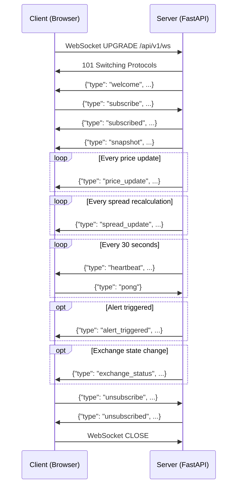
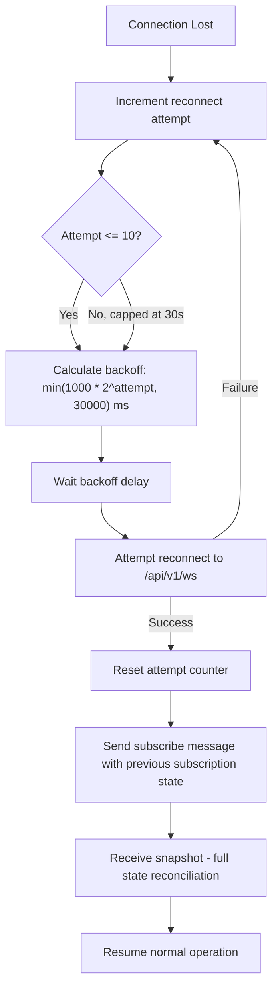
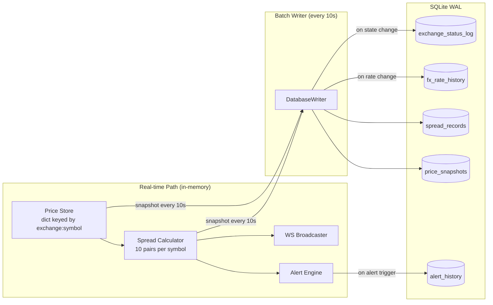

# API Design & Data Models — Crypto Arbitrage Monitor

**Document Date:** 2026-02-28
**Step:** 5 (API & Data Model Design)
**Input Dependencies:** Step 1 (Exchange API Analysis), Step 4 (System Architecture)
**Purpose:** Implementation-ready API specifications, WebSocket event protocol, database schema, and shared type definitions for the Crypto Arbitrage Monitor

---

## Table of Contents

1. [REST API Endpoints](#1-rest-api-endpoints)
2. [WebSocket Event Protocol](#2-websocket-event-protocol)
3. [Database Schema](#3-database-schema)
4. [Shared Type Definitions](#4-shared-type-definitions)
5. [Data Validation Rules](#5-data-validation-rules)
6. [Cross-Step Traceability](#6-cross-step-traceability)

---

## 1. REST API Endpoints

All REST endpoints are versioned under `/api/v1/`. Responses use JSON with UTF-8 encoding. Error responses follow a consistent envelope. Authentication is not required for this portfolio project (single-user deployment).

[trace:step-4:design-decision-dd-1] Per DD-1, all REST and WebSocket endpoints are served from a single FastAPI/Uvicorn process. There is no API gateway or reverse proxy layer in the default architecture.

### 1.1 Common Response Envelope

**Success Response:**

```json
{
  "status": "ok",
  "data": { ... },
  "timestamp_ms": 1709107200000
}
```

**Error Response:**

```json
{
  "status": "error",
  "error": {
    "code": "VALIDATION_ERROR",
    "message": "threshold_pct must be between 0.1 and 50.0",
    "details": { "field": "threshold_pct", "value": -1.0 }
  },
  "timestamp_ms": 1709107200000
}
```

**Error Codes:**

| Code | HTTP Status | Description |
|------|------------|-------------|
| `VALIDATION_ERROR` | 422 | Request body or query parameter validation failed |
| `NOT_FOUND` | 404 | Requested resource does not exist |
| `CONFLICT` | 409 | Duplicate resource or invalid state transition |
| `RATE_LIMITED` | 429 | Too many requests |
| `INTERNAL_ERROR` | 500 | Unexpected server error |
| `SERVICE_UNAVAILABLE` | 503 | Backend dependency unavailable (e.g., all exchanges disconnected) |

### 1.2 Pagination Convention

All list endpoints that may return large datasets support cursor-based pagination:

| Parameter | Type | Default | Description |
|-----------|------|---------|-------------|
| `limit` | integer | 50 | Items per page (max: 200) |
| `offset` | integer | 0 | Number of items to skip |

Paginated responses include a `pagination` field:

```json
{
  "status": "ok",
  "data": [ ... ],
  "pagination": {
    "total": 1523,
    "limit": 50,
    "offset": 0,
    "has_more": true
  },
  "timestamp_ms": 1709107200000
}
```

### 1.3 Rate Limiting

All endpoints share a single rate-limiting pool per client IP:

| Tier | Endpoints | Limit | Window |
|------|-----------|-------|--------|
| Standard | All read endpoints (`GET`) | 60 requests | 1 minute |
| Write | All write endpoints (`POST`, `PUT`, `DELETE`) | 20 requests | 1 minute |
| Health | `GET /api/v1/health` | 120 requests | 1 minute |

Rate limit headers are included in every response:

```
X-RateLimit-Limit: 60
X-RateLimit-Remaining: 57
X-RateLimit-Reset: 1709107260
```

When rate-limited, the server responds with HTTP 429:

```json
{
  "status": "error",
  "error": {
    "code": "RATE_LIMITED",
    "message": "Rate limit exceeded. Retry after 23 seconds.",
    "details": { "retry_after_seconds": 23 }
  }
}
```

---

### 1.4 Health & System

#### `GET /api/v1/health`

Server health check including exchange connection overview.

**Request:** No parameters.

**Response (200):**

```json
{
  "status": "ok",
  "data": {
    "server": {
      "uptime_seconds": 86412,
      "version": "1.0.0",
      "python_version": "3.12.4",
      "started_at": "2026-02-27T02:00:00Z"
    },
    "exchanges": {
      "total": 5,
      "connected": 4,
      "disconnected": 1,
      "summary": {
        "bithumb": "ACTIVE",
        "upbit": "ACTIVE",
        "coinone": "WAIT_RETRY",
        "binance": "ACTIVE",
        "bybit": "ACTIVE"
      }
    },
    "database": {
      "status": "ok",
      "size_mb": 142.5,
      "wal_size_mb": 0.8
    },
    "fx_rate": {
      "rate": "1320.50",
      "source": "upbit",
      "is_stale": false,
      "last_update_ms": 1709107198000
    },
    "tracked_symbols": ["BTC", "ETH", "XRP", "SOL", "DOGE"],
    "active_alerts": 12,
    "dashboard_clients": 2
  },
  "timestamp_ms": 1709107200000
}
```

---

### 1.5 Exchange Status

#### `GET /api/v1/exchanges`

Current connection status for all 5 exchanges with detailed metadata.

**Request:** No parameters.

**Response (200):**

```json
{
  "status": "ok",
  "data": [
    {
      "id": "bithumb",
      "name": "Bithumb",
      "currency": "KRW",
      "state": "ACTIVE",
      "ws_url": "wss://ws-api.bithumb.com/websocket/v1",
      "last_message_ms": 1709107199800,
      "latency_ms": 23,
      "reconnect_count": 0,
      "connected_since_ms": 1709020800000,
      "is_stale": false,
      "stale_threshold_ms": 5000,
      "supported_symbols": ["BTC", "ETH", "XRP", "SOL", "DOGE"]
    },
    {
      "id": "upbit",
      "name": "Upbit",
      "currency": "KRW",
      "state": "ACTIVE",
      "ws_url": "wss://api.upbit.com/websocket/v1",
      "last_message_ms": 1709107199900,
      "latency_ms": 15,
      "reconnect_count": 1,
      "connected_since_ms": 1709050000000,
      "is_stale": false,
      "stale_threshold_ms": 5000,
      "supported_symbols": ["BTC", "ETH", "XRP", "SOL", "DOGE"]
    },
    {
      "id": "coinone",
      "name": "Coinone",
      "currency": "KRW",
      "state": "WAIT_RETRY",
      "ws_url": "wss://stream.coinone.co.kr",
      "last_message_ms": 1709107190000,
      "latency_ms": null,
      "reconnect_count": 3,
      "connected_since_ms": null,
      "is_stale": true,
      "stale_threshold_ms": 5000,
      "fallback_mode": "REST_POLLING",
      "supported_symbols": ["BTC", "ETH", "XRP", "SOL", "DOGE"]
    },
    {
      "id": "binance",
      "name": "Binance",
      "currency": "USDT",
      "state": "ACTIVE",
      "ws_url": "wss://stream.binance.com:9443/ws",
      "last_message_ms": 1709107199950,
      "latency_ms": 45,
      "reconnect_count": 0,
      "connected_since_ms": 1709020800000,
      "is_stale": false,
      "stale_threshold_ms": 5000,
      "supported_symbols": ["BTC", "ETH", "XRP", "SOL", "DOGE"]
    },
    {
      "id": "bybit",
      "name": "Bybit",
      "currency": "USDT",
      "state": "ACTIVE",
      "ws_url": "wss://stream.bybit.com/v5/public/spot",
      "last_message_ms": 1709107199700,
      "latency_ms": 52,
      "reconnect_count": 0,
      "connected_since_ms": 1709020800000,
      "is_stale": false,
      "stale_threshold_ms": 5000,
      "supported_symbols": ["BTC", "ETH", "XRP", "SOL", "DOGE"]
    }
  ],
  "timestamp_ms": 1709107200000
}
```

**Exchange State Enum Values:**

| State | Description |
|-------|-------------|
| `DISCONNECTED` | No active connection |
| `CONNECTING` | TCP/TLS/WS handshake in progress |
| `CONNECTED` | Handshake complete, not yet subscribed |
| `SUBSCRIBING` | Subscription message sent, awaiting confirmation |
| `ACTIVE` | Receiving live data |
| `WAIT_RETRY` | Backoff period before next reconnection attempt |

---

### 1.6 Price Snapshots

#### `GET /api/v1/prices`

Latest prices across all exchanges for all tracked symbols.

**Query Parameters:**

| Parameter | Type | Required | Description |
|-----------|------|----------|-------------|
| `symbols` | string | No | Comma-separated symbol filter (e.g., `BTC,ETH`). Defaults to all tracked. |
| `exchanges` | string | No | Comma-separated exchange filter (e.g., `bithumb,upbit`). Defaults to all. |

**Response (200):**

```json
{
  "status": "ok",
  "data": {
    "prices": [
      {
        "exchange": "bithumb",
        "symbol": "BTC",
        "price": "88200000",
        "currency": "KRW",
        "bid_price": null,
        "ask_price": null,
        "volume_24h": "1234.5678",
        "timestamp_ms": 1709107199800,
        "received_at_ms": 1709107199823,
        "is_stale": false
      },
      {
        "exchange": "binance",
        "symbol": "BTC",
        "price": "65000.15",
        "currency": "USDT",
        "bid_price": "64999.90",
        "ask_price": "65000.20",
        "volume_24h": "45678.1234",
        "timestamp_ms": 1709107199950,
        "received_at_ms": 1709107199995,
        "is_stale": false
      }
    ],
    "fx_rate": {
      "rate": "1320.50",
      "source": "upbit",
      "is_stale": false,
      "last_update_ms": 1709107198000
    }
  },
  "timestamp_ms": 1709107200000
}
```

#### `GET /api/v1/prices/{symbol}`

Latest prices for a specific symbol across all exchanges.

**Path Parameters:**

| Parameter | Type | Required | Description |
|-----------|------|----------|-------------|
| `symbol` | string | Yes | Canonical symbol (e.g., `BTC`, `ETH`) |

**Query Parameters:**

| Parameter | Type | Required | Description |
|-----------|------|----------|-------------|
| `exchanges` | string | No | Comma-separated exchange filter |

**Response (200):** Same structure as `GET /api/v1/prices` but filtered to the single symbol.

**Error (404):** Symbol not tracked.

#### `GET /api/v1/prices/history`

Historical price snapshots with time-range filtering and pagination.

**Query Parameters:**

| Parameter | Type | Required | Default | Description |
|-----------|------|----------|---------|-------------|
| `symbol` | string | Yes | - | Symbol to query (e.g., `BTC`) |
| `exchange` | string | No | all | Comma-separated exchange filter |
| `start_time` | integer | No | 24h ago | Start timestamp (Unix ms) |
| `end_time` | integer | No | now | End timestamp (Unix ms) |
| `interval` | string | No | `10s` | Aggregation interval: `10s`, `1m`, `5m`, `1h` |
| `limit` | integer | No | 50 | Max records (max: 1000) |
| `offset` | integer | No | 0 | Pagination offset |

**Response (200):**

```json
{
  "status": "ok",
  "data": [
    {
      "exchange": "bithumb",
      "symbol": "BTC",
      "price": "88200000",
      "currency": "KRW",
      "volume_24h": "1234.5678",
      "timestamp_ms": 1709107190000,
      "created_at": "2026-02-28T05:00:00Z"
    }
  ],
  "pagination": {
    "total": 8640,
    "limit": 50,
    "offset": 0,
    "has_more": true
  },
  "timestamp_ms": 1709107200000
}
```

**Aggregation intervals:** When `interval` exceeds the raw 10-second snapshot frequency, the server applies in-query aggregation using SQLite's `GROUP BY` on truncated timestamps. The returned `price` is the **last** (closing) price within each interval bucket. `volume_24h` is the value at interval close.

---

### 1.7 Spread Data

#### `GET /api/v1/spreads`

Current spread matrix for all tracked symbols and exchange pairs.

**Query Parameters:**

| Parameter | Type | Required | Description |
|-----------|------|----------|-------------|
| `symbols` | string | No | Comma-separated symbol filter. Defaults to all tracked. |
| `spread_type` | string | No | `kimchi_premium`, `same_currency`, or omit for both |
| `include_stale` | boolean | No | Include stale spreads (default: `true`) |

**Response (200):**

```json
{
  "status": "ok",
  "data": {
    "spreads": [
      {
        "exchange_a": "bithumb",
        "exchange_b": "binance",
        "symbol": "BTC",
        "spread_pct": "3.42",
        "spread_type": "kimchi_premium",
        "is_stale": false,
        "stale_reason": null,
        "price_a": "88200000",
        "price_a_currency": "KRW",
        "price_b": "65000.15",
        "price_b_currency": "USDT",
        "fx_rate": "1320.50",
        "fx_source": "upbit",
        "timestamp_ms": 1709107199800
      },
      {
        "exchange_a": "bithumb",
        "exchange_b": "upbit",
        "symbol": "BTC",
        "spread_pct": "0.23",
        "spread_type": "same_currency",
        "is_stale": false,
        "stale_reason": null,
        "price_a": "88200000",
        "price_a_currency": "KRW",
        "price_b": "88000000",
        "price_b_currency": "KRW",
        "fx_rate": null,
        "fx_source": null,
        "timestamp_ms": 1709107199800
      }
    ],
    "matrix_summary": {
      "symbol": "BTC",
      "max_spread": {
        "pair": "bithumb-binance",
        "spread_pct": "3.42",
        "type": "kimchi_premium"
      },
      "min_spread": {
        "pair": "binance-bybit",
        "spread_pct": "-0.05",
        "type": "same_currency"
      },
      "stale_pairs": 2,
      "total_pairs": 10
    }
  },
  "timestamp_ms": 1709107200000
}
```

#### `GET /api/v1/spreads/history`

Historical spread data with time-range filtering and pagination.

**Query Parameters:**

| Parameter | Type | Required | Default | Description |
|-----------|------|----------|---------|-------------|
| `symbol` | string | Yes | - | Symbol to query |
| `exchange_a` | string | No | any | First exchange in pair |
| `exchange_b` | string | No | any | Second exchange in pair |
| `spread_type` | string | No | both | `kimchi_premium` or `same_currency` |
| `start_time` | integer | No | 24h ago | Start timestamp (Unix ms) |
| `end_time` | integer | No | now | End timestamp (Unix ms) |
| `interval` | string | No | `10s` | Aggregation interval: `10s`, `1m`, `5m`, `1h` |
| `limit` | integer | No | 50 | Max records (max: 1000) |
| `offset` | integer | No | 0 | Pagination offset |

**Response (200):**

```json
{
  "status": "ok",
  "data": [
    {
      "exchange_a": "bithumb",
      "exchange_b": "binance",
      "symbol": "BTC",
      "spread_pct": "3.42",
      "spread_type": "kimchi_premium",
      "is_stale": false,
      "fx_rate": "1320.50",
      "fx_source": "upbit",
      "timestamp_ms": 1709107190000,
      "created_at": "2026-02-28T05:00:00Z"
    }
  ],
  "pagination": {
    "total": 8640,
    "limit": 50,
    "offset": 0,
    "has_more": true
  },
  "timestamp_ms": 1709107200000
}
```

---

### 1.8 Alert Settings CRUD

#### `GET /api/v1/alerts`

List all alert configurations.

**Query Parameters:**

| Parameter | Type | Required | Default | Description |
|-----------|------|----------|---------|-------------|
| `enabled` | boolean | No | all | Filter by enabled/disabled status |
| `symbol` | string | No | all | Filter by symbol |
| `limit` | integer | No | 50 | Max records |
| `offset` | integer | No | 0 | Pagination offset |

**Response (200):**

```json
{
  "status": "ok",
  "data": [
    {
      "id": 1,
      "chat_id": 123456789,
      "symbol": "BTC",
      "exchange_a": null,
      "exchange_b": null,
      "threshold_pct": "3.00",
      "direction": "above",
      "cooldown_minutes": 5,
      "enabled": true,
      "created_at": "2026-02-27T10:00:00Z",
      "updated_at": "2026-02-27T10:00:00Z",
      "last_triggered_at": "2026-02-28T04:30:00Z",
      "trigger_count": 7
    }
  ],
  "pagination": {
    "total": 12,
    "limit": 50,
    "offset": 0,
    "has_more": false
  },
  "timestamp_ms": 1709107200000
}
```

#### `POST /api/v1/alerts`

Create a new alert configuration.

**Request Body:**

```json
{
  "chat_id": 123456789,
  "symbol": "BTC",
  "exchange_a": "bithumb",
  "exchange_b": "binance",
  "threshold_pct": 3.0,
  "direction": "above",
  "cooldown_minutes": 5,
  "enabled": true
}
```

**Field Constraints:**

| Field | Type | Required | Constraints |
|-------|------|----------|-------------|
| `chat_id` | integer | Yes | Positive integer (Telegram chat ID) |
| `symbol` | string | No | Must be in tracked symbols list; `null` = all symbols |
| `exchange_a` | string | No | Must be valid exchange ID; `null` = any exchange |
| `exchange_b` | string | No | Must be valid exchange ID; `null` = any exchange |
| `threshold_pct` | number | Yes | 0.1 to 50.0 (inclusive) |
| `direction` | string | Yes | One of: `above`, `below`, `both` |
| `cooldown_minutes` | integer | No | 1 to 60 (default: 5) |
| `enabled` | boolean | No | Default: `true` |

**Response (201):**

```json
{
  "status": "ok",
  "data": {
    "id": 13,
    "chat_id": 123456789,
    "symbol": "BTC",
    "exchange_a": "bithumb",
    "exchange_b": "binance",
    "threshold_pct": "3.00",
    "direction": "above",
    "cooldown_minutes": 5,
    "enabled": true,
    "created_at": "2026-02-28T05:00:00Z",
    "updated_at": "2026-02-28T05:00:00Z",
    "last_triggered_at": null,
    "trigger_count": 0
  },
  "timestamp_ms": 1709107200000
}
```

**Error (422):** Validation failure (e.g., threshold out of range).

#### `GET /api/v1/alerts/{id}`

Get a single alert configuration by ID.

**Response (200):** Same structure as a single item from the list endpoint.

**Error (404):** Alert not found.

#### `PUT /api/v1/alerts/{id}`

Update an existing alert configuration. All fields are optional; only provided fields are updated.

**Request Body:**

```json
{
  "threshold_pct": 2.5,
  "enabled": false
}
```

**Response (200):** Updated alert object.

**Error (404):** Alert not found.
**Error (422):** Validation failure.

#### `DELETE /api/v1/alerts/{id}`

Delete an alert configuration.

**Response (200):**

```json
{
  "status": "ok",
  "data": {
    "deleted_id": 13,
    "message": "Alert configuration deleted"
  },
  "timestamp_ms": 1709107200000
}
```

**Error (404):** Alert not found.

#### `GET /api/v1/alerts/history`

Alert trigger history log.

**Query Parameters:**

| Parameter | Type | Required | Default | Description |
|-----------|------|----------|---------|-------------|
| `alert_config_id` | integer | No | all | Filter by specific alert config |
| `symbol` | string | No | all | Filter by symbol |
| `delivered` | boolean | No | all | Filter by Telegram delivery status |
| `start_time` | integer | No | 24h ago | Start timestamp (Unix ms) |
| `end_time` | integer | No | now | End timestamp (Unix ms) |
| `limit` | integer | No | 50 | Max records |
| `offset` | integer | No | 0 | Pagination offset |

**Response (200):**

```json
{
  "status": "ok",
  "data": [
    {
      "id": 501,
      "alert_config_id": 1,
      "exchange_a": "bithumb",
      "exchange_b": "binance",
      "symbol": "BTC",
      "spread_pct": "3.42",
      "spread_type": "kimchi_premium",
      "threshold_pct": "3.00",
      "direction": "above",
      "message_text": "...",
      "telegram_delivered": true,
      "telegram_message_id": 98765,
      "fx_rate": "1320.50",
      "fx_source": "upbit",
      "created_at": "2026-02-28T04:30:00Z"
    }
  ],
  "pagination": {
    "total": 47,
    "limit": 50,
    "offset": 0,
    "has_more": false
  },
  "timestamp_ms": 1709107200000
}
```

---

### 1.9 Tracked Symbols

#### `GET /api/v1/symbols`

List all tracked symbols and their status.

**Response (200):**

```json
{
  "status": "ok",
  "data": [
    {
      "symbol": "BTC",
      "enabled": true,
      "exchange_coverage": {
        "bithumb": true,
        "upbit": true,
        "coinone": true,
        "binance": true,
        "bybit": true
      },
      "created_at": "2026-02-27T02:00:00Z"
    },
    {
      "symbol": "ETH",
      "enabled": true,
      "exchange_coverage": {
        "bithumb": true,
        "upbit": true,
        "coinone": true,
        "binance": true,
        "bybit": true
      },
      "created_at": "2026-02-27T02:00:00Z"
    }
  ],
  "timestamp_ms": 1709107200000
}
```

#### `PUT /api/v1/symbols`

Update the tracked symbols list. Replaces the entire list.

**Request Body:**

```json
{
  "symbols": ["BTC", "ETH", "XRP", "SOL", "DOGE", "ADA"]
}
```

**Constraints:**
- 1 to 20 symbols allowed
- Each symbol must be uppercase, 2-10 characters, alphanumeric only
- Duplicate symbols are rejected

**Response (200):**

```json
{
  "status": "ok",
  "data": {
    "symbols": ["BTC", "ETH", "XRP", "SOL", "DOGE", "ADA"],
    "added": ["ADA"],
    "removed": [],
    "message": "Tracked symbols updated. Exchange subscriptions will refresh within 5 seconds."
  },
  "timestamp_ms": 1709107200000
}
```

---

### 1.10 FX Rate

#### `GET /api/v1/fx-rate`

Current KRW/USD exchange rate and source information.

[trace:step-4:design-decision-dd-4] Per DD-4, the primary FX rate source is Upbit's KRW-USDT WebSocket ticker. The ExchangeRate-API REST endpoint serves as a fallback. USDT is used as a USD proxy because it reflects the actual conversion rate Korean traders experience.

**Response (200):**

```json
{
  "status": "ok",
  "data": {
    "rate": "1320.50",
    "source": "upbit",
    "is_stale": false,
    "last_update_ms": 1709107198000,
    "staleness_threshold_ms": 60000,
    "age_ms": 2000,
    "fallback_available": true,
    "fallback_rate": "1319.80",
    "fallback_source": "exchangerate-api",
    "fallback_last_update_ms": 1709103600000
  },
  "timestamp_ms": 1709107200000
}
```

---

### 1.11 User Preferences

#### `GET /api/v1/preferences`

Get current dashboard user preferences. Since this is a single-user system, no user identifier is required.

**Response (200):**

```json
{
  "status": "ok",
  "data": {
    "dashboard": {
      "default_symbol": "BTC",
      "visible_exchanges": ["bithumb", "upbit", "coinone", "binance", "bybit"],
      "spread_matrix_mode": "percentage",
      "chart_interval": "5m",
      "theme": "dark"
    },
    "notifications": {
      "telegram_enabled": true,
      "telegram_chat_id": 123456789,
      "sound_enabled": true
    },
    "timezone": "Asia/Seoul",
    "locale": "ko-KR"
  },
  "timestamp_ms": 1709107200000
}
```

#### `PUT /api/v1/preferences`

Update user preferences. Partial updates supported.

**Request Body:**

```json
{
  "dashboard": {
    "default_symbol": "ETH",
    "theme": "light"
  },
  "timezone": "UTC"
}
```

**Field Constraints:**

| Field | Type | Constraints |
|-------|------|-------------|
| `dashboard.default_symbol` | string | Must be a tracked symbol |
| `dashboard.visible_exchanges` | string[] | 1-5 valid exchange IDs |
| `dashboard.spread_matrix_mode` | string | `percentage` or `absolute` |
| `dashboard.chart_interval` | string | `10s`, `1m`, `5m`, `1h` |
| `dashboard.theme` | string | `dark` or `light` |
| `notifications.telegram_enabled` | boolean | - |
| `notifications.telegram_chat_id` | integer | Positive integer |
| `notifications.sound_enabled` | boolean | - |
| `timezone` | string | Valid IANA timezone identifier |
| `locale` | string | `ko-KR` or `en-US` |

**Response (200):** Updated preferences object.

---

### 1.12 Endpoint Summary Table

| Method | Path | Description | Rate Tier |
|--------|------|-------------|-----------|
| `GET` | `/api/v1/health` | Server health + exchange summary | Health |
| `GET` | `/api/v1/exchanges` | Detailed exchange connection status | Standard |
| `GET` | `/api/v1/prices` | Latest prices (all exchanges, all symbols) | Standard |
| `GET` | `/api/v1/prices/{symbol}` | Latest prices for one symbol | Standard |
| `GET` | `/api/v1/prices/history` | Historical price snapshots | Standard |
| `GET` | `/api/v1/spreads` | Current spread matrix | Standard |
| `GET` | `/api/v1/spreads/history` | Historical spread data | Standard |
| `GET` | `/api/v1/alerts` | List alert configurations | Standard |
| `POST` | `/api/v1/alerts` | Create alert configuration | Write |
| `GET` | `/api/v1/alerts/{id}` | Get single alert config | Standard |
| `PUT` | `/api/v1/alerts/{id}` | Update alert configuration | Write |
| `DELETE` | `/api/v1/alerts/{id}` | Delete alert configuration | Write |
| `GET` | `/api/v1/alerts/history` | Alert trigger history | Standard |
| `GET` | `/api/v1/symbols` | List tracked symbols | Standard |
| `PUT` | `/api/v1/symbols` | Update tracked symbol list | Write |
| `GET` | `/api/v1/fx-rate` | Current KRW/USD rate | Standard |
| `GET` | `/api/v1/preferences` | Get user preferences | Standard |
| `PUT` | `/api/v1/preferences` | Update user preferences | Write |

---

## 2. WebSocket Event Protocol

The server exposes a single WebSocket endpoint for real-time dashboard updates:

```
WS /api/v1/ws
```

All messages are JSON-encoded text frames. Binary frames are not used.

### 2.1 Connection Lifecycle



### 2.2 Server-to-Client Message Types

Every server message includes a `type` field, a `data` payload, and a `seq` sequence number for ordering and missed-event detection:

```json
{
  "type": "<event_type>",
  "data": { ... },
  "seq": 12345,
  "timestamp_ms": 1709107200000
}
```

The `seq` field is a monotonically increasing integer (per connection). Clients can detect missed events by checking for gaps in the sequence.

---

#### 2.2.1 `welcome`

Sent immediately after WebSocket connection is established.

```json
{
  "type": "welcome",
  "data": {
    "server_version": "1.0.0",
    "available_symbols": ["BTC", "ETH", "XRP", "SOL", "DOGE"],
    "exchanges": ["bithumb", "upbit", "coinone", "binance", "bybit"],
    "heartbeat_interval_ms": 30000
  },
  "seq": 0,
  "timestamp_ms": 1709107200000
}
```

#### 2.2.2 `snapshot`

Sent after a successful subscription. Contains the full current state for all subscribed symbols so the client can render immediately without waiting for the first incremental update.

```json
{
  "type": "snapshot",
  "data": {
    "prices": [
      {
        "exchange": "bithumb",
        "symbol": "BTC",
        "price": "88200000",
        "currency": "KRW",
        "bid_price": null,
        "ask_price": null,
        "volume_24h": "1234.5678",
        "timestamp_ms": 1709107199800,
        "is_stale": false
      }
    ],
    "spreads": [
      {
        "exchange_a": "bithumb",
        "exchange_b": "binance",
        "symbol": "BTC",
        "spread_pct": "3.42",
        "spread_type": "kimchi_premium",
        "is_stale": false,
        "fx_rate": "1320.50",
        "fx_source": "upbit",
        "timestamp_ms": 1709107199800
      }
    ],
    "exchange_statuses": [
      {
        "exchange": "bithumb",
        "state": "ACTIVE",
        "latency_ms": 23,
        "last_message_ms": 1709107199800
      }
    ],
    "fx_rate": {
      "rate": "1320.50",
      "source": "upbit",
      "is_stale": false
    }
  },
  "seq": 2,
  "timestamp_ms": 1709107200000
}
```

#### 2.2.3 `price_update`

Sent on every normalized price tick from any exchange for subscribed symbols.

```json
{
  "type": "price_update",
  "data": {
    "exchange": "bithumb",
    "symbol": "BTC",
    "price": "88250000",
    "currency": "KRW",
    "bid_price": null,
    "ask_price": null,
    "volume_24h": "1235.0012",
    "timestamp_ms": 1709107200500,
    "is_stale": false
  },
  "seq": 15,
  "timestamp_ms": 1709107200510
}
```

#### 2.2.4 `spread_update`

Sent after spread recalculation triggered by a price update. Multiple spread updates may arrive in rapid succession (one per affected exchange pair).

```json
{
  "type": "spread_update",
  "data": {
    "exchange_a": "bithumb",
    "exchange_b": "binance",
    "symbol": "BTC",
    "spread_pct": "3.45",
    "spread_type": "kimchi_premium",
    "is_stale": false,
    "stale_reason": null,
    "price_a": "88250000",
    "price_a_currency": "KRW",
    "price_b": "65010.20",
    "price_b_currency": "USDT",
    "fx_rate": "1320.50",
    "fx_source": "upbit",
    "timestamp_ms": 1709107200500
  },
  "seq": 16,
  "timestamp_ms": 1709107200512
}
```

#### 2.2.5 `alert_triggered`

Sent when an alert threshold is exceeded. This is a dashboard notification — the Telegram message is sent independently by the Alert Engine.

[trace:step-4:design-decision-dd-5] The 3-tier alert severity mapping (Info >= 1.0%, Warning >= 2.0%, Critical >= 3.0%) is applied by the server. The `severity` field allows the frontend to apply different visual treatments (color, animation) per tier.

```json
{
  "type": "alert_triggered",
  "data": {
    "alert_config_id": 1,
    "exchange_a": "bithumb",
    "exchange_b": "binance",
    "symbol": "BTC",
    "spread_pct": "3.42",
    "spread_type": "kimchi_premium",
    "threshold_pct": "3.00",
    "direction": "above",
    "severity": "critical",
    "fx_rate": "1320.50",
    "fx_source": "upbit",
    "telegram_delivered": true,
    "timestamp_ms": 1709107200500
  },
  "seq": 17,
  "timestamp_ms": 1709107200600
}
```

**Severity Mapping:**

| Spread (absolute) | Severity | Frontend Treatment |
|-------------------|----------|-------------------|
| >= 3.0% | `critical` | Red badge, pulse animation, sound alert |
| >= 2.0% | `warning` | Orange badge, subtle animation |
| >= 1.0% | `info` | Yellow badge, no animation |
| < 1.0% | (no alert) | - |

#### 2.2.6 `exchange_status`

Sent when an exchange connector changes state (e.g., disconnect, reconnect, staleness detection).

```json
{
  "type": "exchange_status",
  "data": {
    "exchange": "coinone",
    "state": "WAIT_RETRY",
    "previous_state": "ACTIVE",
    "latency_ms": null,
    "last_message_ms": 1709107190000,
    "reconnect_attempt": 3,
    "is_stale": true,
    "fallback_mode": "REST_POLLING",
    "reason": "WebSocket connection reset by peer"
  },
  "seq": 18,
  "timestamp_ms": 1709107200700
}
```

#### 2.2.7 `heartbeat`

Sent every 30 seconds by the server. The client must respond with a `pong` within 10 seconds or the server may close the connection.

```json
{
  "type": "heartbeat",
  "data": {
    "server_time_ms": 1709107230000
  },
  "seq": 19,
  "timestamp_ms": 1709107230000
}
```

#### 2.2.8 `error`

Sent when the server encounters an error processing a client message.

```json
{
  "type": "error",
  "data": {
    "code": "INVALID_SYMBOL",
    "message": "Symbol 'INVALID' is not tracked",
    "original_message_type": "subscribe"
  },
  "seq": 20,
  "timestamp_ms": 1709107230100
}
```

### 2.3 Client-to-Server Message Types

#### 2.3.1 `subscribe`

Subscribe to real-time updates for specific symbols. Must be sent after connection to start receiving data.

```json
{
  "type": "subscribe",
  "symbols": ["BTC", "ETH"],
  "channels": ["prices", "spreads", "alerts", "exchange_status"]
}
```

**Fields:**

| Field | Type | Required | Default | Description |
|-------|------|----------|---------|-------------|
| `symbols` | string[] | No | all tracked | Symbols to subscribe to |
| `channels` | string[] | No | all | Channel filter |

**Available Channels:**

| Channel | Events Delivered |
|---------|-----------------|
| `prices` | `price_update` |
| `spreads` | `spread_update` |
| `alerts` | `alert_triggered` |
| `exchange_status` | `exchange_status` |

**Server Response:** `subscribed` confirmation followed by a `snapshot`.

```json
{
  "type": "subscribed",
  "data": {
    "symbols": ["BTC", "ETH"],
    "channels": ["prices", "spreads", "alerts", "exchange_status"]
  },
  "seq": 1,
  "timestamp_ms": 1709107200000
}
```

#### 2.3.2 `unsubscribe`

Remove specific symbols or channels from the subscription.

```json
{
  "type": "unsubscribe",
  "symbols": ["ETH"]
}
```

**Server Response:**

```json
{
  "type": "unsubscribed",
  "data": {
    "symbols": ["ETH"],
    "remaining_symbols": ["BTC"]
  },
  "seq": 25,
  "timestamp_ms": 1709107300000
}
```

#### 2.3.3 `pong`

Response to a server heartbeat.

```json
{
  "type": "pong"
}
```

### 2.4 Reconnection Protocol

When the WebSocket connection is lost, the client follows this reconnection strategy:



**Key behaviors:**

1. **Automatic resubscription:** The client stores its current subscription state (symbols + channels) and re-sends the `subscribe` message after reconnection.
2. **State reconciliation via snapshot:** The server sends a fresh `snapshot` after each `subscribe`, ensuring the client has the correct current state regardless of what happened during the disconnection gap.
3. **Missed event detection:** The client compares the `seq` of the first post-reconnection message against the last received `seq`. A gap indicates missed events, but the `snapshot` already provides full current state, so no explicit replay mechanism is needed.
4. **Backoff:** Exponential backoff from 1 second to 30 seconds maximum, with no jitter (single client, no thundering herd concern).

### 2.5 Connection Limits

| Parameter | Value | Rationale |
|-----------|-------|-----------|
| Max concurrent WS clients | 20 | Portfolio project; prevents resource exhaustion |
| Max subscriptions per client | All symbols (up to 20) | No per-client restriction needed |
| Heartbeat interval | 30 seconds | Balance between early disconnect detection and bandwidth |
| Pong timeout | 10 seconds | Generous timeout for browser tabs in background |
| Max message size (client→server) | 4 KB | Subscribe/unsubscribe messages are small |
| Max message size (server→client) | 64 KB | Snapshot messages can be large |

---

## 3. Database Schema

[trace:step-4:design-decision-dd-6] Per DD-6, the database uses SQLite in WAL mode with 10-second periodic snapshots and 30-day retention. Prices are stored as TEXT (string representation of Decimal) to preserve exact precision. The SQLAlchemy async ORM enables future migration to PostgreSQL/TimescaleDB by changing only the connection string.

[trace:step-4:design-decision-dd-8] Per DD-8, SQLite WAL mode is chosen for zero infrastructure overhead. The busy_timeout is set to 5000ms and synchronous=NORMAL for safe-but-fast writes.

### 3.1 Entity-Relationship Diagram

```mermaid
erDiagram
    exchanges {
        TEXT id PK "e.g. bithumb"
        TEXT name "Display name e.g. Bithumb"
        TEXT currency "KRW or USDT"
        TEXT ws_url "WebSocket endpoint URL"
        TEXT rest_url "REST API base URL"
        INTEGER is_active "1=active, 0=disabled"
        INTEGER created_at "Unix timestamp seconds"
    }

    tracked_symbols {
        TEXT symbol PK "e.g. BTC"
        INTEGER enabled "1=tracking, 0=paused"
        INTEGER created_at "Unix timestamp seconds"
        INTEGER updated_at "Unix timestamp seconds"
    }

    price_snapshots {
        INTEGER id PK "AUTOINCREMENT"
        TEXT exchange_id FK "references exchanges.id"
        TEXT symbol FK "references tracked_symbols.symbol"
        TEXT price "Decimal string"
        TEXT currency "KRW or USDT"
        TEXT bid_price "Decimal string or NULL"
        TEXT ask_price "Decimal string or NULL"
        TEXT volume_24h "Decimal string"
        INTEGER exchange_timestamp_ms "Exchange server time"
        INTEGER received_at_ms "Local receipt time"
        INTEGER created_at "Unix timestamp seconds"
    }

    spread_records {
        INTEGER id PK "AUTOINCREMENT"
        TEXT exchange_a FK "references exchanges.id"
        TEXT exchange_b FK "references exchanges.id"
        TEXT symbol FK "references tracked_symbols.symbol"
        TEXT spread_pct "Decimal string"
        TEXT spread_type "kimchi_premium or same_currency"
        TEXT price_a "Decimal string"
        TEXT price_b "Decimal string"
        INTEGER is_stale "1=stale, 0=fresh"
        TEXT stale_reason "NULL if fresh"
        TEXT fx_rate "Decimal string or NULL"
        TEXT fx_source "upbit or exchangerate-api or NULL"
        INTEGER timestamp_ms "Calculation time"
        INTEGER created_at "Unix timestamp seconds"
    }

    alert_configs {
        INTEGER id PK "AUTOINCREMENT"
        INTEGER chat_id "Telegram chat ID"
        TEXT symbol "NULL means all symbols"
        TEXT exchange_a "NULL means any exchange"
        TEXT exchange_b "NULL means any exchange"
        TEXT threshold_pct "Decimal string"
        TEXT direction "above or below or both"
        INTEGER cooldown_minutes "1-60"
        INTEGER enabled "1 or 0"
        INTEGER created_at "Unix timestamp seconds"
        INTEGER updated_at "Unix timestamp seconds"
    }

    alert_history {
        INTEGER id PK "AUTOINCREMENT"
        INTEGER alert_config_id FK "references alert_configs.id"
        TEXT exchange_a "Snapshot at trigger time"
        TEXT exchange_b "Snapshot at trigger time"
        TEXT symbol "Snapshot at trigger time"
        TEXT spread_pct "Decimal string at trigger"
        TEXT spread_type "kimchi_premium or same_currency"
        TEXT threshold_pct "Threshold at trigger time"
        TEXT direction "Direction at trigger time"
        TEXT price_a "Decimal string"
        TEXT price_b "Decimal string"
        TEXT fx_rate "Decimal string or NULL"
        TEXT fx_source "Source or NULL"
        TEXT message_text "Full Telegram message"
        INTEGER telegram_delivered "1=sent, 0=failed"
        INTEGER telegram_message_id "Telegram msg ID or NULL"
        INTEGER created_at "Unix timestamp seconds"
    }

    exchange_status_log {
        INTEGER id PK "AUTOINCREMENT"
        TEXT exchange_id FK "references exchanges.id"
        TEXT state "Connection state enum value"
        TEXT previous_state "Previous state"
        INTEGER latency_ms "NULL if disconnected"
        TEXT reason "Disconnect reason or NULL"
        INTEGER created_at "Unix timestamp seconds"
    }

    fx_rate_history {
        INTEGER id PK "AUTOINCREMENT"
        TEXT rate "Decimal string"
        TEXT source "upbit or exchangerate-api"
        INTEGER timestamp_ms "Rate observation time"
        INTEGER created_at "Unix timestamp seconds"
    }

    user_preferences {
        INTEGER id PK "Always 1 for single-user"
        TEXT preferences_json "JSON blob"
        INTEGER updated_at "Unix timestamp seconds"
    }

    exchanges ||--o{ price_snapshots : "has prices"
    exchanges ||--o{ spread_records : "is exchange_a"
    exchanges ||--o{ spread_records : "is exchange_b"
    exchanges ||--o{ exchange_status_log : "has status"
    tracked_symbols ||--o{ price_snapshots : "tracked as"
    tracked_symbols ||--o{ spread_records : "for symbol"
    alert_configs ||--o{ alert_history : "triggers"
```



### 3.2 Table Definitions

#### `exchanges`

Static reference table seeded on first run. Rows are not deleted.

```sql
CREATE TABLE exchanges (
    id          TEXT PRIMARY KEY,
    name        TEXT NOT NULL,
    currency    TEXT NOT NULL CHECK (currency IN ('KRW', 'USDT')),
    ws_url      TEXT NOT NULL,
    rest_url    TEXT,
    is_active   INTEGER NOT NULL DEFAULT 1,
    created_at  INTEGER NOT NULL DEFAULT (unixepoch())
);

-- Seed data
INSERT INTO exchanges VALUES
    ('bithumb',  'Bithumb',  'KRW',  'wss://ws-api.bithumb.com/websocket/v1',  'https://api.bithumb.com', 1, unixepoch()),
    ('upbit',    'Upbit',    'KRW',  'wss://api.upbit.com/websocket/v1',        'https://api.upbit.com',   1, unixepoch()),
    ('coinone',  'Coinone',  'KRW',  'wss://stream.coinone.co.kr',              'https://api.coinone.co.kr', 1, unixepoch()),
    ('binance',  'Binance',  'USDT', 'wss://stream.binance.com:9443/ws',        'https://api.binance.com', 1, unixepoch()),
    ('bybit',    'Bybit',    'USDT', 'wss://stream.bybit.com/v5/public/spot',   'https://api.bybit.com',   1, unixepoch());
```

#### `tracked_symbols`

```sql
CREATE TABLE tracked_symbols (
    symbol      TEXT PRIMARY KEY,
    enabled     INTEGER NOT NULL DEFAULT 1,
    created_at  INTEGER NOT NULL DEFAULT (unixepoch()),
    updated_at  INTEGER NOT NULL DEFAULT (unixepoch())
);

-- Seed data
INSERT INTO tracked_symbols (symbol) VALUES
    ('BTC'), ('ETH'), ('XRP'), ('SOL'), ('DOGE');
```

#### `price_snapshots`

High-volume table. Written every 10 seconds per (exchange, symbol) pair. Subject to 30-day retention cleanup.

```sql
CREATE TABLE price_snapshots (
    id                      INTEGER PRIMARY KEY AUTOINCREMENT,
    exchange_id             TEXT NOT NULL REFERENCES exchanges(id),
    symbol                  TEXT NOT NULL REFERENCES tracked_symbols(symbol),
    price                   TEXT NOT NULL,
    currency                TEXT NOT NULL,
    bid_price               TEXT,
    ask_price               TEXT,
    volume_24h              TEXT NOT NULL,
    exchange_timestamp_ms   INTEGER NOT NULL,
    received_at_ms          INTEGER NOT NULL,
    created_at              INTEGER NOT NULL DEFAULT (unixepoch())
);

-- Query indexes
CREATE INDEX idx_price_snapshots_symbol_time
    ON price_snapshots (symbol, created_at DESC);

CREATE INDEX idx_price_snapshots_exchange_symbol_time
    ON price_snapshots (exchange_id, symbol, created_at DESC);

-- Retention cleanup index
CREATE INDEX idx_price_snapshots_created_at
    ON price_snapshots (created_at);
```

**Estimated row volume:** 5 exchanges x 5 symbols x 6 snapshots/min x 60 min x 24 hr = ~216,000 rows/day. At 30-day retention: ~6.5M rows max.

#### `spread_records`

```sql
CREATE TABLE spread_records (
    id              INTEGER PRIMARY KEY AUTOINCREMENT,
    exchange_a      TEXT NOT NULL REFERENCES exchanges(id),
    exchange_b      TEXT NOT NULL REFERENCES exchanges(id),
    symbol          TEXT NOT NULL REFERENCES tracked_symbols(symbol),
    spread_pct      TEXT NOT NULL,
    spread_type     TEXT NOT NULL CHECK (spread_type IN ('kimchi_premium', 'same_currency')),
    price_a         TEXT NOT NULL,
    price_b         TEXT NOT NULL,
    is_stale        INTEGER NOT NULL DEFAULT 0,
    stale_reason    TEXT,
    fx_rate         TEXT,
    fx_source       TEXT,
    timestamp_ms    INTEGER NOT NULL,
    created_at      INTEGER NOT NULL DEFAULT (unixepoch())
);

-- Query indexes
CREATE INDEX idx_spread_records_symbol_time
    ON spread_records (symbol, created_at DESC);

CREATE INDEX idx_spread_records_pair_symbol_time
    ON spread_records (exchange_a, exchange_b, symbol, created_at DESC);

-- Retention cleanup index
CREATE INDEX idx_spread_records_created_at
    ON spread_records (created_at);
```

**Estimated row volume:** 10 pairs x 5 symbols x 6/min x 60 x 24 = ~432,000 rows/day. At 30-day retention: ~13M rows max.

#### `alert_configs`

```sql
CREATE TABLE alert_configs (
    id                  INTEGER PRIMARY KEY AUTOINCREMENT,
    chat_id             INTEGER NOT NULL,
    symbol              TEXT REFERENCES tracked_symbols(symbol),
    exchange_a          TEXT REFERENCES exchanges(id),
    exchange_b          TEXT REFERENCES exchanges(id),
    threshold_pct       TEXT NOT NULL,
    direction           TEXT NOT NULL CHECK (direction IN ('above', 'below', 'both')),
    cooldown_minutes    INTEGER NOT NULL DEFAULT 5 CHECK (cooldown_minutes BETWEEN 1 AND 60),
    enabled             INTEGER NOT NULL DEFAULT 1,
    last_triggered_at   INTEGER,
    trigger_count       INTEGER NOT NULL DEFAULT 0,
    created_at          INTEGER NOT NULL DEFAULT (unixepoch()),
    updated_at          INTEGER NOT NULL DEFAULT (unixepoch())
);

-- Filter by chat_id for Telegram bot queries
CREATE INDEX idx_alert_configs_chat_id
    ON alert_configs (chat_id);

-- Active alerts lookup (used by AlertEngine on every spread check)
CREATE INDEX idx_alert_configs_enabled
    ON alert_configs (enabled) WHERE enabled = 1;
```

#### `alert_history`

Indefinite retention (not subject to 30-day cleanup). Expected low volume.

```sql
CREATE TABLE alert_history (
    id                  INTEGER PRIMARY KEY AUTOINCREMENT,
    alert_config_id     INTEGER NOT NULL REFERENCES alert_configs(id),
    exchange_a          TEXT NOT NULL,
    exchange_b          TEXT NOT NULL,
    symbol              TEXT NOT NULL,
    spread_pct          TEXT NOT NULL,
    spread_type         TEXT NOT NULL,
    threshold_pct       TEXT NOT NULL,
    direction           TEXT NOT NULL,
    price_a             TEXT NOT NULL,
    price_b             TEXT NOT NULL,
    fx_rate             TEXT,
    fx_source           TEXT,
    message_text        TEXT NOT NULL,
    telegram_delivered   INTEGER NOT NULL DEFAULT 0,
    telegram_message_id  INTEGER,
    created_at          INTEGER NOT NULL DEFAULT (unixepoch())
);

CREATE INDEX idx_alert_history_config_time
    ON alert_history (alert_config_id, created_at DESC);

CREATE INDEX idx_alert_history_symbol_time
    ON alert_history (symbol, created_at DESC);
```

#### `exchange_status_log`

Tracks connection state transitions for debugging and dashboard history.

```sql
CREATE TABLE exchange_status_log (
    id              INTEGER PRIMARY KEY AUTOINCREMENT,
    exchange_id     TEXT NOT NULL REFERENCES exchanges(id),
    state           TEXT NOT NULL,
    previous_state  TEXT,
    latency_ms      INTEGER,
    reason          TEXT,
    created_at      INTEGER NOT NULL DEFAULT (unixepoch())
);

CREATE INDEX idx_exchange_status_log_exchange_time
    ON exchange_status_log (exchange_id, created_at DESC);

-- Retention cleanup
CREATE INDEX idx_exchange_status_log_created_at
    ON exchange_status_log (created_at);
```

#### `fx_rate_history`

Deduplicated: only records when the rate changes by >= 0.01 KRW.

```sql
CREATE TABLE fx_rate_history (
    id              INTEGER PRIMARY KEY AUTOINCREMENT,
    rate            TEXT NOT NULL,
    source          TEXT NOT NULL CHECK (source IN ('upbit', 'exchangerate-api')),
    timestamp_ms    INTEGER NOT NULL,
    created_at      INTEGER NOT NULL DEFAULT (unixepoch())
);

CREATE INDEX idx_fx_rate_history_time
    ON fx_rate_history (created_at DESC);
```

#### `user_preferences`

Single-row table for the single-user system.

```sql
CREATE TABLE user_preferences (
    id                  INTEGER PRIMARY KEY DEFAULT 1 CHECK (id = 1),
    preferences_json    TEXT NOT NULL DEFAULT '{}',
    updated_at          INTEGER NOT NULL DEFAULT (unixepoch())
);

INSERT INTO user_preferences (preferences_json) VALUES ('{
    "dashboard": {
        "default_symbol": "BTC",
        "visible_exchanges": ["bithumb", "upbit", "coinone", "binance", "bybit"],
        "spread_matrix_mode": "percentage",
        "chart_interval": "5m",
        "theme": "dark"
    },
    "notifications": {
        "telegram_enabled": true,
        "telegram_chat_id": null,
        "sound_enabled": true
    },
    "timezone": "Asia/Seoul",
    "locale": "ko-KR"
}');
```

### 3.3 Data Retention Policy

| Table | Retention | Cleanup Schedule | Strategy |
|-------|-----------|-----------------|----------|
| `price_snapshots` | 30 days | Daily at 03:00 UTC | `DELETE WHERE created_at < unixepoch() - 2592000` |
| `spread_records` | 30 days | Daily at 03:00 UTC | Same |
| `exchange_status_log` | 30 days | Daily at 03:00 UTC | Same |
| `fx_rate_history` | 30 days | Daily at 03:00 UTC | Same |
| `alert_configs` | Indefinite | Never | User-managed |
| `alert_history` | Indefinite | Never | Low volume (~100 rows/day) |
| `exchanges` | Indefinite | Never | Static reference data |
| `tracked_symbols` | Indefinite | Never | User-managed |
| `user_preferences` | Indefinite | Never | Single row |

**Cleanup implementation:**

```python
async def daily_cleanup(session: AsyncSession) -> dict[str, int]:
    """Run daily at 03:00 UTC via asyncio scheduled task."""
    cutoff = int(time.time()) - (30 * 24 * 3600)
    results = {}

    for table in [PriceSnapshot, SpreadRecord, ExchangeStatusLog, FxRateHistory]:
        result = await session.execute(
            delete(table).where(table.created_at < cutoff)
        )
        results[table.__tablename__] = result.rowcount

    await session.commit()

    # VACUUM to reclaim space (run periodically, not daily)
    # await session.execute(text("VACUUM"))

    return results
```

### 3.4 SQLite WAL Configuration

Applied on every database connection via SQLAlchemy event listener:

```sql
PRAGMA journal_mode = WAL;        -- Write-Ahead Logging for concurrent reads during writes
PRAGMA synchronous = NORMAL;      -- fsync on checkpoint only (safe with WAL, faster writes)
PRAGMA busy_timeout = 5000;       -- 5-second retry on SQLITE_BUSY
PRAGMA cache_size = -20000;       -- 20 MB page cache
PRAGMA foreign_keys = ON;         -- Enforce FK constraints
PRAGMA temp_store = MEMORY;       -- Temp tables in RAM
```

### 3.5 Data Flow Diagram (Write Path)



---

## 4. Shared Type Definitions

### 4.1 Enum Types

#### Python Enums (Backend)

```python
from enum import StrEnum


class ExchangeId(StrEnum):
    """Canonical exchange identifiers. Used as DB primary keys and API values."""
    BITHUMB = "bithumb"
    UPBIT = "upbit"
    COINONE = "coinone"
    BINANCE = "binance"
    BYBIT = "bybit"


class Currency(StrEnum):
    """Quote currencies used by exchanges."""
    KRW = "KRW"
    USDT = "USDT"


class ConnectorState(StrEnum):
    """WebSocket connector lifecycle states."""
    DISCONNECTED = "DISCONNECTED"
    CONNECTING = "CONNECTING"
    CONNECTED = "CONNECTED"
    SUBSCRIBING = "SUBSCRIBING"
    ACTIVE = "ACTIVE"
    WAIT_RETRY = "WAIT_RETRY"


class SpreadType(StrEnum):
    """Types of spread calculations."""
    KIMCHI_PREMIUM = "kimchi_premium"
    SAME_CURRENCY = "same_currency"


class AlertDirection(StrEnum):
    """Alert trigger direction."""
    ABOVE = "above"
    BELOW = "below"
    BOTH = "both"


class AlertSeverity(StrEnum):
    """Alert severity tiers based on spread magnitude."""
    INFO = "info"          # >= 1.0%
    WARNING = "warning"    # >= 2.0%
    CRITICAL = "critical"  # >= 3.0%


class FxRateSource(StrEnum):
    """FX rate data sources."""
    UPBIT = "upbit"
    EXCHANGERATE_API = "exchangerate-api"


class FallbackMode(StrEnum):
    """Coinone connector fallback modes."""
    NONE = "none"
    REST_POLLING = "REST_POLLING"


class WsEventType(StrEnum):
    """WebSocket event type identifiers."""
    WELCOME = "welcome"
    SNAPSHOT = "snapshot"
    PRICE_UPDATE = "price_update"
    SPREAD_UPDATE = "spread_update"
    ALERT_TRIGGERED = "alert_triggered"
    EXCHANGE_STATUS = "exchange_status"
    HEARTBEAT = "heartbeat"
    ERROR = "error"
    SUBSCRIBE = "subscribe"
    SUBSCRIBED = "subscribed"
    UNSUBSCRIBE = "unsubscribe"
    UNSUBSCRIBED = "unsubscribed"
    PONG = "pong"


class WsChannel(StrEnum):
    """WebSocket subscription channels."""
    PRICES = "prices"
    SPREADS = "spreads"
    ALERTS = "alerts"
    EXCHANGE_STATUS = "exchange_status"
```

#### TypeScript Enums (Frontend)

```typescript
// types/enums.ts

export const ExchangeId = {
  BITHUMB: "bithumb",
  UPBIT: "upbit",
  COINONE: "coinone",
  BINANCE: "binance",
  BYBIT: "bybit",
} as const;
export type ExchangeId = (typeof ExchangeId)[keyof typeof ExchangeId];

export const Currency = {
  KRW: "KRW",
  USDT: "USDT",
} as const;
export type Currency = (typeof Currency)[keyof typeof Currency];

export const ConnectorState = {
  DISCONNECTED: "DISCONNECTED",
  CONNECTING: "CONNECTING",
  CONNECTED: "CONNECTED",
  SUBSCRIBING: "SUBSCRIBING",
  ACTIVE: "ACTIVE",
  WAIT_RETRY: "WAIT_RETRY",
} as const;
export type ConnectorState = (typeof ConnectorState)[keyof typeof ConnectorState];

export const SpreadType = {
  KIMCHI_PREMIUM: "kimchi_premium",
  SAME_CURRENCY: "same_currency",
} as const;
export type SpreadType = (typeof SpreadType)[keyof typeof SpreadType];

export const AlertDirection = {
  ABOVE: "above",
  BELOW: "below",
  BOTH: "both",
} as const;
export type AlertDirection = (typeof AlertDirection)[keyof typeof AlertDirection];

export const AlertSeverity = {
  INFO: "info",
  WARNING: "warning",
  CRITICAL: "critical",
} as const;
export type AlertSeverity = (typeof AlertSeverity)[keyof typeof AlertSeverity];

export const FxRateSource = {
  UPBIT: "upbit",
  EXCHANGERATE_API: "exchangerate-api",
} as const;
export type FxRateSource = (typeof FxRateSource)[keyof typeof FxRateSource];

export const WsEventType = {
  WELCOME: "welcome",
  SNAPSHOT: "snapshot",
  PRICE_UPDATE: "price_update",
  SPREAD_UPDATE: "spread_update",
  ALERT_TRIGGERED: "alert_triggered",
  EXCHANGE_STATUS: "exchange_status",
  HEARTBEAT: "heartbeat",
  ERROR: "error",
  SUBSCRIBE: "subscribe",
  SUBSCRIBED: "subscribed",
  UNSUBSCRIBE: "unsubscribe",
  UNSUBSCRIBED: "unsubscribed",
  PONG: "pong",
} as const;
export type WsEventType = (typeof WsEventType)[keyof typeof WsEventType];

export const WsChannel = {
  PRICES: "prices",
  SPREADS: "spreads",
  ALERTS: "alerts",
  EXCHANGE_STATUS: "exchange_status",
} as const;
export type WsChannel = (typeof WsChannel)[keyof typeof WsChannel];
```

### 4.2 Python Pydantic Models (Backend)

```python
# schemas/ticker.py
from decimal import Decimal
from dataclasses import dataclass


@dataclass(frozen=True, slots=True)
class TickerUpdate:
    """Normalized price update from any exchange connector.

    This is an internal dataclass (not a Pydantic model) for maximum
    performance in the hot path. It is created by each connector's
    normalize() method and consumed by the PriceStore.
    """
    exchange: str
    symbol: str
    price: Decimal
    currency: str
    volume_24h: Decimal
    timestamp_ms: int
    received_at_ms: int
    bid_price: Decimal | None = None
    ask_price: Decimal | None = None
```

```python
# schemas/spread.py
from decimal import Decimal
from dataclasses import dataclass


@dataclass(frozen=True, slots=True)
class SpreadResult:
    """Computed spread between two exchanges for a single symbol."""
    exchange_a: str
    exchange_b: str
    symbol: str
    spread_pct: Decimal
    spread_type: str              # "kimchi_premium" | "same_currency"
    timestamp_ms: int
    is_stale: bool
    stale_reason: str | None
    price_a: Decimal
    price_b: Decimal
    fx_rate: Decimal | None       # None for same-currency
    fx_source: str | None         # "upbit" | "exchangerate-api"
```

```python
# schemas/api.py
from pydantic import BaseModel, Field, field_validator
from typing import Any


# --- Common ---

class ApiResponse(BaseModel):
    """Standard API response envelope."""
    status: str = "ok"
    data: Any
    timestamp_ms: int


class ApiError(BaseModel):
    """Standard API error envelope."""
    status: str = "error"
    error: dict  # {code, message, details}
    timestamp_ms: int


class PaginationMeta(BaseModel):
    total: int
    limit: int
    offset: int
    has_more: bool


class PaginatedResponse(BaseModel):
    status: str = "ok"
    data: list[Any]
    pagination: PaginationMeta
    timestamp_ms: int


# --- Price ---

class PriceEntry(BaseModel):
    exchange: str
    symbol: str
    price: str
    currency: str
    bid_price: str | None = None
    ask_price: str | None = None
    volume_24h: str
    timestamp_ms: int
    received_at_ms: int
    is_stale: bool


class FxRateInfo(BaseModel):
    rate: str
    source: str
    is_stale: bool
    last_update_ms: int


class PricesResponse(BaseModel):
    prices: list[PriceEntry]
    fx_rate: FxRateInfo


# --- Spread ---

class SpreadEntry(BaseModel):
    exchange_a: str
    exchange_b: str
    symbol: str
    spread_pct: str
    spread_type: str
    is_stale: bool
    stale_reason: str | None = None
    price_a: str
    price_a_currency: str
    price_b: str
    price_b_currency: str
    fx_rate: str | None = None
    fx_source: str | None = None
    timestamp_ms: int


class SpreadMatrixSummary(BaseModel):
    symbol: str
    max_spread: dict
    min_spread: dict
    stale_pairs: int
    total_pairs: int


class SpreadsResponse(BaseModel):
    spreads: list[SpreadEntry]
    matrix_summary: SpreadMatrixSummary | None = None


# --- Alert Config ---

class AlertConfigCreate(BaseModel):
    """Request body for POST /api/v1/alerts."""
    chat_id: int = Field(gt=0)
    symbol: str | None = Field(default=None, min_length=2, max_length=10, pattern=r"^[A-Z0-9]+$")
    exchange_a: str | None = None
    exchange_b: str | None = None
    threshold_pct: float = Field(ge=0.1, le=50.0)
    direction: str = Field(pattern=r"^(above|below|both)$")
    cooldown_minutes: int = Field(default=5, ge=1, le=60)
    enabled: bool = True

    @field_validator("exchange_a", "exchange_b")
    @classmethod
    def validate_exchange(cls, v: str | None) -> str | None:
        if v is not None:
            valid = {"bithumb", "upbit", "coinone", "binance", "bybit"}
            if v not in valid:
                raise ValueError(f"Invalid exchange: {v}. Must be one of {valid}")
        return v


class AlertConfigUpdate(BaseModel):
    """Request body for PUT /api/v1/alerts/{id}. All fields optional."""
    symbol: str | None = Field(default=None, min_length=2, max_length=10, pattern=r"^[A-Z0-9]+$")
    exchange_a: str | None = None
    exchange_b: str | None = None
    threshold_pct: float | None = Field(default=None, ge=0.1, le=50.0)
    direction: str | None = Field(default=None, pattern=r"^(above|below|both)$")
    cooldown_minutes: int | None = Field(default=None, ge=1, le=60)
    enabled: bool | None = None


class AlertConfigResponse(BaseModel):
    id: int
    chat_id: int
    symbol: str | None
    exchange_a: str | None
    exchange_b: str | None
    threshold_pct: str
    direction: str
    cooldown_minutes: int
    enabled: bool
    created_at: str
    updated_at: str
    last_triggered_at: str | None
    trigger_count: int


# --- Alert History ---

class AlertHistoryEntry(BaseModel):
    id: int
    alert_config_id: int
    exchange_a: str
    exchange_b: str
    symbol: str
    spread_pct: str
    spread_type: str
    threshold_pct: str
    direction: str
    price_a: str
    price_b: str
    fx_rate: str | None
    fx_source: str | None
    message_text: str
    telegram_delivered: bool
    telegram_message_id: int | None
    created_at: str


# --- Exchange Status ---

class ExchangeStatus(BaseModel):
    id: str
    name: str
    currency: str
    state: str
    ws_url: str
    last_message_ms: int | None
    latency_ms: int | None
    reconnect_count: int
    connected_since_ms: int | None
    is_stale: bool
    stale_threshold_ms: int = 5000
    fallback_mode: str | None = None
    supported_symbols: list[str]


# --- Symbols ---

class SymbolEntry(BaseModel):
    symbol: str
    enabled: bool
    exchange_coverage: dict[str, bool]
    created_at: str


class SymbolsUpdate(BaseModel):
    """Request body for PUT /api/v1/symbols."""
    symbols: list[str] = Field(min_length=1, max_length=20)

    @field_validator("symbols")
    @classmethod
    def validate_symbols(cls, v: list[str]) -> list[str]:
        seen = set()
        for s in v:
            if not s.isalnum() or not s.isupper() or len(s) < 2 or len(s) > 10:
                raise ValueError(f"Invalid symbol: {s}. Must be 2-10 uppercase alphanumeric characters.")
            if s in seen:
                raise ValueError(f"Duplicate symbol: {s}")
            seen.add(s)
        return v


# --- Health ---

class HealthResponse(BaseModel):
    server: dict
    exchanges: dict
    database: dict
    fx_rate: FxRateInfo
    tracked_symbols: list[str]
    active_alerts: int
    dashboard_clients: int


# --- User Preferences ---

class DashboardPreferences(BaseModel):
    default_symbol: str = "BTC"
    visible_exchanges: list[str] = Field(default_factory=lambda: ["bithumb", "upbit", "coinone", "binance", "bybit"])
    spread_matrix_mode: str = Field(default="percentage", pattern=r"^(percentage|absolute)$")
    chart_interval: str = Field(default="5m", pattern=r"^(10s|1m|5m|1h)$")
    theme: str = Field(default="dark", pattern=r"^(dark|light)$")


class NotificationPreferences(BaseModel):
    telegram_enabled: bool = True
    telegram_chat_id: int | None = None
    sound_enabled: bool = True


class UserPreferences(BaseModel):
    dashboard: DashboardPreferences = DashboardPreferences()
    notifications: NotificationPreferences = NotificationPreferences()
    timezone: str = "Asia/Seoul"
    locale: str = Field(default="ko-KR", pattern=r"^(ko-KR|en-US)$")


class UserPreferencesUpdate(BaseModel):
    """Partial update. All fields optional."""
    dashboard: DashboardPreferences | None = None
    notifications: NotificationPreferences | None = None
    timezone: str | None = None
    locale: str | None = None
```

### 4.3 TypeScript Interfaces (Frontend)

```typescript
// types/index.ts

import type {
  ExchangeId, Currency, ConnectorState, SpreadType,
  AlertDirection, AlertSeverity, FxRateSource, WsEventType, WsChannel,
} from "./enums";

// --- Common ---

export interface ApiResponse<T> {
  status: "ok";
  data: T;
  timestamp_ms: number;
}

export interface ApiError {
  status: "error";
  error: {
    code: string;
    message: string;
    details?: Record<string, unknown>;
  };
  timestamp_ms: number;
}

export interface PaginationMeta {
  total: number;
  limit: number;
  offset: number;
  has_more: boolean;
}

export interface PaginatedResponse<T> {
  status: "ok";
  data: T[];
  pagination: PaginationMeta;
  timestamp_ms: number;
}

// --- Price ---

export interface PriceEntry {
  exchange: ExchangeId;
  symbol: string;
  price: string;            // Decimal-as-string for precision
  currency: Currency;
  bid_price: string | null;
  ask_price: string | null;
  volume_24h: string;
  timestamp_ms: number;
  received_at_ms: number;
  is_stale: boolean;
}

export interface FxRateInfo {
  rate: string;
  source: FxRateSource;
  is_stale: boolean;
  last_update_ms: number;
}

export interface PricesData {
  prices: PriceEntry[];
  fx_rate: FxRateInfo;
}

export interface PriceHistoryEntry {
  exchange: ExchangeId;
  symbol: string;
  price: string;
  currency: Currency;
  volume_24h: string;
  timestamp_ms: number;
  created_at: string;
}

// --- Spread ---

export interface SpreadEntry {
  exchange_a: ExchangeId;
  exchange_b: ExchangeId;
  symbol: string;
  spread_pct: string;
  spread_type: SpreadType;
  is_stale: boolean;
  stale_reason: string | null;
  price_a: string;
  price_a_currency: Currency;
  price_b: string;
  price_b_currency: Currency;
  fx_rate: string | null;
  fx_source: FxRateSource | null;
  timestamp_ms: number;
}

export interface SpreadMatrixSummary {
  symbol: string;
  max_spread: {
    pair: string;
    spread_pct: string;
    type: SpreadType;
  };
  min_spread: {
    pair: string;
    spread_pct: string;
    type: SpreadType;
  };
  stale_pairs: number;
  total_pairs: number;
}

export interface SpreadsData {
  spreads: SpreadEntry[];
  matrix_summary: SpreadMatrixSummary | null;
}

export interface SpreadHistoryEntry {
  exchange_a: ExchangeId;
  exchange_b: ExchangeId;
  symbol: string;
  spread_pct: string;
  spread_type: SpreadType;
  is_stale: boolean;
  fx_rate: string | null;
  fx_source: FxRateSource | null;
  timestamp_ms: number;
  created_at: string;
}

// --- Alert Config ---

export interface AlertConfig {
  id: number;
  chat_id: number;
  symbol: string | null;
  exchange_a: ExchangeId | null;
  exchange_b: ExchangeId | null;
  threshold_pct: string;
  direction: AlertDirection;
  cooldown_minutes: number;
  enabled: boolean;
  created_at: string;
  updated_at: string;
  last_triggered_at: string | null;
  trigger_count: number;
}

export interface AlertConfigCreate {
  chat_id: number;
  symbol?: string | null;
  exchange_a?: ExchangeId | null;
  exchange_b?: ExchangeId | null;
  threshold_pct: number;
  direction: AlertDirection;
  cooldown_minutes?: number;
  enabled?: boolean;
}

export interface AlertConfigUpdate {
  symbol?: string | null;
  exchange_a?: ExchangeId | null;
  exchange_b?: ExchangeId | null;
  threshold_pct?: number;
  direction?: AlertDirection;
  cooldown_minutes?: number;
  enabled?: boolean;
}

export interface AlertHistoryEntry {
  id: number;
  alert_config_id: number;
  exchange_a: ExchangeId;
  exchange_b: ExchangeId;
  symbol: string;
  spread_pct: string;
  spread_type: SpreadType;
  threshold_pct: string;
  direction: AlertDirection;
  price_a: string;
  price_b: string;
  fx_rate: string | null;
  fx_source: FxRateSource | null;
  message_text: string;
  telegram_delivered: boolean;
  telegram_message_id: number | null;
  created_at: string;
}

// --- Exchange ---

export interface ExchangeStatus {
  id: ExchangeId;
  name: string;
  currency: Currency;
  state: ConnectorState;
  ws_url: string;
  last_message_ms: number | null;
  latency_ms: number | null;
  reconnect_count: number;
  connected_since_ms: number | null;
  is_stale: boolean;
  stale_threshold_ms: number;
  fallback_mode: string | null;
  supported_symbols: string[];
}

// --- Symbols ---

export interface TrackedSymbol {
  symbol: string;
  enabled: boolean;
  exchange_coverage: Record<ExchangeId, boolean>;
  created_at: string;
}

// --- Health ---

export interface HealthData {
  server: {
    uptime_seconds: number;
    version: string;
    python_version: string;
    started_at: string;
  };
  exchanges: {
    total: number;
    connected: number;
    disconnected: number;
    summary: Record<ExchangeId, ConnectorState>;
  };
  database: {
    status: string;
    size_mb: number;
    wal_size_mb: number;
  };
  fx_rate: FxRateInfo;
  tracked_symbols: string[];
  active_alerts: number;
  dashboard_clients: number;
}

// --- Preferences ---

export interface DashboardPreferences {
  default_symbol: string;
  visible_exchanges: ExchangeId[];
  spread_matrix_mode: "percentage" | "absolute";
  chart_interval: "10s" | "1m" | "5m" | "1h";
  theme: "dark" | "light";
}

export interface NotificationPreferences {
  telegram_enabled: boolean;
  telegram_chat_id: number | null;
  sound_enabled: boolean;
}

export interface UserPreferences {
  dashboard: DashboardPreferences;
  notifications: NotificationPreferences;
  timezone: string;
  locale: "ko-KR" | "en-US";
}

// --- WebSocket Messages ---

export interface WsMessage<T = unknown> {
  type: WsEventType;
  data: T;
  seq: number;
  timestamp_ms: number;
}

export interface WsSubscribeMessage {
  type: "subscribe";
  symbols?: string[];
  channels?: WsChannel[];
}

export interface WsUnsubscribeMessage {
  type: "unsubscribe";
  symbols?: string[];
}

export interface WsPongMessage {
  type: "pong";
}

// Server-to-client payload types
export interface WsWelcomeData {
  server_version: string;
  available_symbols: string[];
  exchanges: ExchangeId[];
  heartbeat_interval_ms: number;
}

export interface WsSnapshotData {
  prices: PriceEntry[];
  spreads: SpreadEntry[];
  exchange_statuses: {
    exchange: ExchangeId;
    state: ConnectorState;
    latency_ms: number | null;
    last_message_ms: number | null;
  }[];
  fx_rate: FxRateInfo;
}

export interface WsAlertTriggeredData {
  alert_config_id: number;
  exchange_a: ExchangeId;
  exchange_b: ExchangeId;
  symbol: string;
  spread_pct: string;
  spread_type: SpreadType;
  threshold_pct: string;
  direction: AlertDirection;
  severity: AlertSeverity;
  fx_rate: string | null;
  fx_source: FxRateSource | null;
  telegram_delivered: boolean;
  timestamp_ms: number;
}

export interface WsExchangeStatusData {
  exchange: ExchangeId;
  state: ConnectorState;
  previous_state: ConnectorState;
  latency_ms: number | null;
  last_message_ms: number | null;
  reconnect_attempt: number;
  is_stale: boolean;
  fallback_mode: string | null;
  reason: string | null;
}

export interface WsHeartbeatData {
  server_time_ms: number;
}

export interface WsErrorData {
  code: string;
  message: string;
  original_message_type: string;
}
```

### 4.4 Exchange-to-Canonical Mapping Constants

These constants define the mapping between exchange-specific market codes and canonical symbols, used by each connector's normalize() method:

```python
# Mapping from exchange ID to its currency zone
EXCHANGE_CURRENCY: dict[str, str] = {
    "bithumb": "KRW",
    "upbit":   "KRW",
    "coinone": "KRW",
    "binance": "USDT",
    "bybit":   "USDT",
}

# Exchange pairs grouped by spread type
KIMCHI_PREMIUM_PAIRS: list[tuple[str, str]] = [
    ("bithumb", "binance"), ("bithumb", "bybit"),
    ("upbit",   "binance"), ("upbit",   "bybit"),
    ("coinone", "binance"), ("coinone", "bybit"),
]

SAME_CURRENCY_PAIRS: list[tuple[str, str]] = [
    ("bithumb", "upbit"), ("bithumb", "coinone"), ("upbit", "coinone"),
    ("binance", "bybit"),
]

ALL_EXCHANGE_PAIRS = KIMCHI_PREMIUM_PAIRS + SAME_CURRENCY_PAIRS  # 10 total

# Default tracked symbols
DEFAULT_SYMBOLS: list[str] = ["BTC", "ETH", "XRP", "SOL", "DOGE"]

# Alert severity thresholds (absolute spread percentage)
ALERT_SEVERITY_THRESHOLDS: dict[str, float] = {
    "critical": 3.0,
    "warning":  2.0,
    "info":     1.0,
}

# Staleness thresholds
PRICE_STALE_THRESHOLD_MS: int = 5_000       # 5 seconds
FX_RATE_STALE_THRESHOLD_MS: int = 60_000    # 60 seconds

# Database write interval
DB_WRITE_INTERVAL_SECONDS: float = 10.0

# Data retention
RETENTION_DAYS: int = 30
```

---

## 5. Data Validation Rules

### 5.1 Alert Configuration Validation

| Field | Rule | Error Code |
|-------|------|-----------|
| `chat_id` | Must be positive integer | `VALIDATION_ERROR` |
| `symbol` | If provided, must exist in `tracked_symbols` table with `enabled=1` | `VALIDATION_ERROR` |
| `exchange_a` | If provided, must be in `{bithumb, upbit, coinone, binance, bybit}` | `VALIDATION_ERROR` |
| `exchange_b` | If provided, must be in the same set; must differ from `exchange_a` | `VALIDATION_ERROR` |
| `threshold_pct` | 0.1 <= value <= 50.0 (float, 2 decimal places stored) | `VALIDATION_ERROR` |
| `direction` | Must be `above`, `below`, or `both` | `VALIDATION_ERROR` |
| `cooldown_minutes` | 1 <= value <= 60 (integer) | `VALIDATION_ERROR` |
| `enabled` | Boolean | `VALIDATION_ERROR` |

**Business rules:**
- If both `exchange_a` and `exchange_b` are specified, the pair must be valid (i.e., they cannot be the same exchange).
- A user may create at most 50 alert configurations per `chat_id` to prevent abuse.
- Duplicate alerts (same chat_id + symbol + exchange_a + exchange_b + direction) are rejected with `CONFLICT`.

### 5.2 Trading Pair Validation

| Rule | Description |
|------|-------------|
| Symbol format | 2-10 uppercase alphanumeric characters: `^[A-Z0-9]{2,10}$` |
| Symbol list size | 1 to 20 symbols allowed |
| No duplicates | Duplicate symbols in a single request are rejected |
| Exchange ID format | Must match one of the 5 canonical exchange IDs |

### 5.3 Query Parameter Validation

| Parameter | Rule |
|-----------|------|
| `start_time` | Unix milliseconds, must be >= 0, must be < `end_time` |
| `end_time` | Unix milliseconds, must be >= `start_time`, must be <= current time + 60s (1-minute clock skew tolerance) |
| `limit` | 1 to 200 for standard endpoints, 1 to 1000 for history endpoints |
| `offset` | >= 0 |
| `interval` | Must be one of: `10s`, `1m`, `5m`, `1h` |
| `spread_type` | Must be `kimchi_premium` or `same_currency` if provided |
| Comma-separated lists | Each element individually validated (e.g., `symbols=BTC,ETH` validates each) |

### 5.4 Input Sanitization

| Category | Rule |
|----------|------|
| String length | All string inputs max 100 characters unless otherwise specified |
| JSON body size | Max 10 KB for request bodies |
| URL path parameters | Alphanumeric + hyphens only (e.g., symbol, exchange ID) |
| No HTML/script injection | All string inputs are used as database parameters (parameterized queries via SQLAlchemy) — no raw SQL concatenation |
| Unicode | UTF-8 only; non-UTF-8 bytes rejected at the ASGI layer |

### 5.5 Rate Limiting Details

**Implementation:** FastAPI middleware using an in-memory sliding window counter keyed by client IP.

```python
from fastapi import Request
from collections import defaultdict
import time

class RateLimiter:
    """In-memory sliding window rate limiter."""

    def __init__(self):
        self._windows: dict[str, list[float]] = defaultdict(list)

    def check(self, key: str, limit: int, window_seconds: int) -> tuple[bool, int, int]:
        """Returns (allowed, remaining, reset_seconds)."""
        now = time.time()
        cutoff = now - window_seconds

        # Clean expired entries
        self._windows[key] = [t for t in self._windows[key] if t > cutoff]

        remaining = limit - len(self._windows[key])
        reset = int(cutoff + window_seconds - now)

        if remaining <= 0:
            return False, 0, reset

        self._windows[key].append(now)
        return True, remaining - 1, reset
```

**Tier assignment** is based on route tags in FastAPI:

```python
@app.middleware("http")
async def rate_limit_middleware(request: Request, call_next):
    ip = request.client.host
    path = request.url.path
    method = request.method

    if path == "/api/v1/health":
        limit, window = 120, 60
    elif method in ("POST", "PUT", "DELETE"):
        limit, window = 20, 60
    else:
        limit, window = 60, 60

    allowed, remaining, reset = limiter.check(f"{ip}:{path_tier}", limit, window)

    if not allowed:
        return JSONResponse(status_code=429, content={...})

    response = await call_next(request)
    response.headers["X-RateLimit-Limit"] = str(limit)
    response.headers["X-RateLimit-Remaining"] = str(remaining)
    response.headers["X-RateLimit-Reset"] = str(int(time.time()) + reset)
    return response
```

### 5.6 WebSocket Input Validation

| Message Field | Rule |
|---------------|------|
| `type` | Must be `subscribe`, `unsubscribe`, or `pong` |
| `symbols` | Each must be 2-10 uppercase alphanumeric characters |
| `channels` | Each must be in `{prices, spreads, alerts, exchange_status}` |
| Message size | Max 4 KB (reject oversized frames) |
| Rate | Max 10 client messages per second per connection (burst protection) |

Invalid client messages receive a `type: "error"` response. The connection is not closed unless the client sends 50+ invalid messages in 1 minute (abuse protection).

---

## 6. Cross-Step Traceability

This document references the following design decisions from Step 4 (System Architecture):

| Trace Marker | Decision | Where Referenced | Impact on API Design |
|-------------|----------|-----------------|---------------------|
| `[trace:step-4:design-decision-dd-1]` | Single-process asyncio architecture | Section 1, REST Endpoints | All REST and WebSocket endpoints served from one FastAPI process. No API gateway. In-memory rate limiter suffices (no distributed state needed). |
| `[trace:step-4:design-decision-dd-4]` | Upbit KRW-USDT as primary FX rate | Section 1.10, FX Rate endpoint | FX rate endpoint exposes both primary (Upbit) and fallback (ExchangeRate-API) sources with staleness tracking. Spread calculations include `fx_source` field for transparency. |
| `[trace:step-4:design-decision-dd-5]` | Per-exchange connectors with websockets library | Section 2.2.5, alert_triggered event | 3-tier alert severity (Info/Warning/Critical) mapped to spread percentage thresholds. WebSocket events carry `severity` field for frontend visual differentiation. |
| `[trace:step-4:design-decision-dd-6]` | SQLite WAL with 10-second snapshots | Section 3, Database Schema | Price and spread tables use `created_at` indexes for 30-day retention cleanup. History endpoints support `interval` aggregation to compensate for 10-second snapshot granularity. |
| `[trace:step-4:design-decision-dd-8]` | SQLite WAL over PostgreSQL | Section 3.4, WAL Configuration | SQLite PRAGMAs (WAL, NORMAL sync, 5s busy_timeout) documented. All prices stored as TEXT (string Decimals) for exact precision. Schema designed for future PostgreSQL migration via SQLAlchemy. |

### Additional Step 1 references in upstream architecture:

- Exchange-specific data formats (Bithumb/Upbit `trade_price` vs. Binance `c` vs. Bybit `lastPrice`) informed the normalization map in Section 4.2 (`TickerUpdate` dataclass).
- The 10 exchange-pair spread matrix (6 kimchi premium + 4 same-currency) from Step 4 Section 5.2 is directly represented in the `KIMCHI_PREMIUM_PAIRS` and `SAME_CURRENCY_PAIRS` constants in Section 4.4.
- The 5-second staleness threshold (Step 4 Section 5.4) is encoded as `PRICE_STALE_THRESHOLD_MS = 5000` and surfaces in every price and spread response as `is_stale` + `stale_reason` fields.

---

## Appendix A: Aggregation Query Examples

For the `/prices/history` and `/spreads/history` endpoints with `interval` parameter:

```sql
-- 1-minute aggregated price history (last price per bucket)
SELECT
    exchange_id,
    symbol,
    price,
    currency,
    volume_24h,
    exchange_timestamp_ms,
    created_at
FROM price_snapshots
WHERE symbol = :symbol
  AND created_at >= :start_time
  AND created_at <= :end_time
  AND id IN (
    SELECT MAX(id)
    FROM price_snapshots
    WHERE symbol = :symbol
      AND created_at >= :start_time
      AND created_at <= :end_time
    GROUP BY exchange_id, (created_at / 60)
  )
ORDER BY created_at DESC
LIMIT :limit OFFSET :offset;
```

```sql
-- 5-minute aggregated spread history
SELECT
    exchange_a,
    exchange_b,
    symbol,
    spread_pct,
    spread_type,
    is_stale,
    fx_rate,
    fx_source,
    timestamp_ms,
    created_at
FROM spread_records
WHERE symbol = :symbol
  AND created_at >= :start_time
  AND created_at <= :end_time
  AND id IN (
    SELECT MAX(id)
    FROM spread_records
    WHERE symbol = :symbol
      AND created_at >= :start_time
      AND created_at <= :end_time
    GROUP BY exchange_a, exchange_b, (created_at / 300)
  )
ORDER BY created_at DESC
LIMIT :limit OFFSET :offset;
```

## Appendix B: WebSocket Message Size Estimates

| Event Type | Typical Size | Max Size | Frequency |
|-----------|-------------|---------|-----------|
| `welcome` | ~200 bytes | ~500 bytes | 1 per connection |
| `snapshot` | ~5 KB | ~20 KB | 1 per subscribe |
| `price_update` | ~250 bytes | ~300 bytes | ~25/second (all symbols, all exchanges) |
| `spread_update` | ~350 bytes | ~400 bytes | ~50/second peak (10 pairs recalculated per price update) |
| `alert_triggered` | ~400 bytes | ~500 bytes | Rare (depends on thresholds) |
| `exchange_status` | ~300 bytes | ~400 bytes | Rare (state changes only) |
| `heartbeat` | ~80 bytes | ~80 bytes | 1 per 30 seconds |

**Bandwidth estimate per dashboard client:** At peak (all 5 symbols active, all exchanges streaming), approximately 25 price_updates/s x 250 bytes + 50 spread_updates/s x 350 bytes = ~24 KB/s downstream. This is well within browser WebSocket capacity.
